<div align="center">
<h1>Markdown Viewer</h1>
  
  
</div>

<div align="center">
  <p><strong>A Markdown Editor That Lives in Your Browser, Desktop, and a Single URL.</strong></p>
  <p>Fast GitHub-style Markdown editing with live preview, diagrams, LaTeX, syntax highlighting, PDF export, and multi-tab support across web, desktop, and Docker.</p>

  <p>
    <a href="https://markdownviewer.pages.dev/" target="_blank" rel="noopener noreferrer"><strong>Live Production Demo</strong></a> ·
    <a href="wiki/Home" rel="noopener noreferrer">Documentation Wiki</a> ·
    <a href="https://github.com/ThisIs-Developer/Markdown-Viewer/issues" target="_blank" rel="noopener noreferrer">Issue Tracker</a> ·
    <a href="https://github.com/ThisIs-Developer/Markdown-Viewer/releases" target="_blank" rel="noopener noreferrer">Releases</a>
  </p>

  <p>
    
    
    
    
  </p>

  <p>
    <a href="https://codewiki.google/github.com/thisis-developer/markdown-viewer" target="_blank" rel="noopener noreferrer">
      
    </a>
    <a href="https://deepwiki.com/ThisIs-Developer/Markdown-Viewer" target="_blank" rel="noopener noreferrer">
      
    </a>
    <a href="https://oosmetrics.com/repo/ThisIs-Developer/Markdown-Viewer" target="_blank" rel="noopener noreferrer">
      
    </a>
  </p>
</div>

<p align="center">
  
</p>


## Table of Contents

- [About the Project](#about-the-project)
- [Key Features](#key-features)
- [System Architecture](#system-architecture)
  - [High-Level Architecture Diagram](#high-level-architecture-diagram)
  - [Core File Walkthrough](#core-file-walkthrough)
- [Under-the-Hood Subsystems Deep-Dive](#under-the-hood-subsystems-deep-dive)
  - [1. Global State & Session Persistence](#1-global-state--session-persistence)
  - [2. Document Tab & Session Lifecycle](#2-document-tab--session-lifecycle)
  - [3. Tab Overflow & Navigation](#3-tab-overflow--navigation)
  - [4. Responsive Pane Resizer & View Mode Layout Controller](#4-responsive-pane-resizer--view-mode-layout-controller)
  - [5. Rich Text Editor History & Undo/Redo Engine](#5-rich-text-editor-history--undoredo-engine)
  - [6. Dynamic Line-Number Gutter & Selection Highlighter](#6-dynamic-line-number-gutter--selection-highlighter)
  - [7. Web Worker Segmented Markdown Compilation & Sanitization](#7-web-worker-segmented-markdown-compilation--sanitization)
  - [8. Throttled Bidirectional Scroll Synchronization](#8-throttled-bidirectional-scroll-synchronization)
  - [9. Interactive Mermaid Diagram & MathJax LaTeX Renderer](#9-interactive-mermaid-diagram--mathjax-latex-renderer)
  - [10. Draggable Find/Replace Search & Diff Preview Engine](#10-draggable-findreplace-search--diff-preview-engine)
  - [11. Layout-Aware PDF Export & URL Sharing Subsystem](#11-layout-aware-pdf-export--url-sharing-subsystem)
- [Getting Started & Installation](#getting-started--installation)
  - [Option 1: Docker (Pre-built Image)](#option-1-docker-pre-built-image)
  - [Option 2: Docker Compose (Local Build)](#option-2-docker-compose-local-build)
  - [Option 3: Local Static Web Server](#option-3-local-static-web-server)
  - [Option 4: Desktop Application](#option-4-desktop-application)
- [Usage Guide & Keyboard Shortcuts](#usage-guide--keyboard-shortcuts)
- [Project Directory Structure](#project-directory-structure)
- [Built With (Technology Stack)](#built-with-technology-stack)
- [Contributing & Code Quality](#contributing--code-quality)
- [Showcase & Community Projects](#showcase--community-projects)
- [License](#license)
- [Contact & Support](#contact--support)

---

## About the Project

**Markdown Viewer** is an advanced, fully client-side editing suite and previewer optimized for a professional documentation workflow. Running completely inside the browser, it renders GitHub-Flavored Markdown (GFM), math formulas, and architectural diagrams in real time. 

Designed with privacy and performance at its core, the application performs all parsing in a background worker thread, employs incremental DOM patching to minimize browser repaints, and supports native offline capabilities via a Service Worker proxy. It is also packaged as a lightweight native desktop shell using the Neutralinojs framework.

---

## Key Features

*   **🖊️ Decoupled Split-Screen Editing:** Type Markdown in a custom editor with wrap-aware line numbers and view updates instantly.
*   **📐 LaTeX Math Notation:** Render inline and block mathematical formulas natively via MathJax.
    <p align="center">
      
    </p>
*   **📊 Interactive Mermaid Diagrams:** Draw flowcharts, Gantt charts, and sequence diagrams with zoom, pan, and SVG export.
    <p align="center">
      
      
    </p>
*   **🗺️ Interactive Map & 3D Renderers:** Parse and display GeoJSON, TopoJSON, and STL (ASCII/Binary) files with full camera/viewport controls.
    <p align="center">
      <!-- screenshot placeholder: Interactive Map & 3D Renderers -->
    </p>
*   **💾 Multi-Document Tab Workspace:** Organize multiple files inside drag-and-drop tabs with local session persistence and rename/duplicate options.
*   **🔍 Find & Replace with Diff Preview:** Scrutinize text with regular expressions, AST-scoped queries, and visual side-by-side replacements.
    <p align="center">
      
    </p>
*   **🛠️ Formatting Toolbar & Quick Modals:** Insert tables, emoji, special symbols, and GitHub alerts directly through quick-action dialogs.
    <p align="center">
      <!-- screenshot placeholder: Formatting Toolbar & Modals -->
    </p>
*   **🌐 Multi-Language Translation (i18n):** Switch between English, Simplified Chinese, Japanese, Korean, Portuguese, and 9 other languages with automatic preferences detection.
    <p align="center">
      <!-- screenshot placeholder: Multi-Language Switcher & UI -->
    </p>
*   **📤 Professional Export Suite:** Save work as raw Markdown (`.md`), styled inline HTML (`.html`), or paginated PDF (`.pdf`) with re-engineered page breaks.
*   **📥 Multi-Source File Import:** Import local files or browse and download directories directly from public GitHub repositories.
    <p align="center">
      
      
    </p>
*   **🔗 Serverless Compressed URL Sharing:** Encode and share compressed view/edit mode documents database-free via DEFLATE zlib URLs.
    <p align="center">
      
    </p>
*   **⚡ Off-Thread Parsing & Performance:** Leverage Web Worker compilation, differential content hashing render bypass, and lineCache optimizations.
*   **🔒 Security, PWA & Offline Desktop Shell:** Work 100% offline using Service Worker caching or a Native Neutralinojs desktop app with confirmed exits, secured by SHA-384 SRI hashes.
    <p align="center">
      <!-- screenshot placeholder: PWA & Offline Desktop App -->
    </p>

---

## System Architecture

Markdown Viewer is structured as a client-side single-page application (SPA). The diagram below outlines how the UI thread, background worker, service worker, browser cache, native desktop bridges, and third-party libraries interact.

### High-Level Architecture Diagram

```mermaid
graph TD
    %% Client Interface Group
    subgraph UI ["Client Interface (Main Thread)"]
        HTML["index.html<br>(DOM Tree)"]
        CSS["styles.css<br>(Custom Themes & Reset)"]
        Script["script.js<br>(UI Orchestration)"]
        Editor["Markdown Editor<br>(Textarea + Gutter)"]
        Preview["Preview Pane<br>(Isolated Render Area)"]
        Modal["Mermaid Modal<br>(Zoom & Drag-to-Pan)"]
    end

    %% Background Web Worker Group
    subgraph Worker ["Web Worker (Background Thread)"]
        PWorker["preview-worker.js<br>(Off-Thread Compiler)"]
        MarkedLib["Marked.js<br>(GFM Parser)"]
        HljsLib["Highlight.js<br>(Syntax Color)"]
    end

    %% Storage Group
    subgraph Storage ["Local Storage & Network Proxy"]
        LS["localStorage<br>(Tabs, Settings, Session)"]
        Cache["Browser Cache<br>(Service Worker sw.js)"]
    end

    %% Third-Party Utilities
    subgraph CDNs ["Third-Party CDN Libraries (Lazy Loaded)"]
        MathJax["MathJax.js<br>(LaTeX Math)"]
        Mermaid["Mermaid.js<br>(Diagrams)"]
        PDF["jsPDF & html2canvas<br>(PDF Export Pipeline)"]
        Pako["Pako.js<br>(zlib share encoder)"]
    end

    %% Native Desktop Layer
    subgraph Desktop ["NeutralinoJS Desktop Shell"]
        Neu["Neutralino.js Bridge<br>(Native File System APIs)"]
    end

    %% Interactions
    Editor -- "1. Input Keystrokes" --> Script
    Script -- "2. Size-Aware Debounced Text" --> PWorker
    PWorker -- "3. Load Scripts" --> MarkedLib
    PWorker -- "3. Load Scripts" --> HljsLib
    PWorker -- "4. Returns Compiled HTML Blocks & Hashes" --> Script
    Script -- "5. Incremental Patching (replaceWith)" --> Preview
    Script -- "6. Debounced State Auto-Save" --> LS
    
    %% Dynamic Loading triggers
    Script -- "Lazy Load (Math strings detected)" --> MathJax
    Script -- "Lazy Load (Mermaid block detected)" --> Mermaid
    Script -- "Lazy Load (On PDF Export click)" --> PDF
    Script -- "Lazy Load (On Share click)" --> Pako
    
    %% Downstream Rendering outputs
    MathJax -- "Inject Math formulas" --> Preview
    Mermaid -- "Draw SVGs + Toolbars" --> Preview
    Preview -- "Double click diagram" --> Modal
    PDF -- "Capture sandboxed canvas" --> Script
    
    %% Network Proxy Caching
    Cache -. "Network-First (App Assets)" .-> HTML
    Cache -. "Network-First (App Assets)" .-> Script
    Cache -. "Network-First (App Assets)" .-> CSS
    Cache -. "Cache-First (5.4MB bundles)" .-> CDNs
    
    %% Desktop Logic
    Script -- "Access OS API if wrapped" --> Neu
```



### Core File Walkthrough

1.  **`index.html`**: Establishes layout structures, floating panel anchors, and imports CSS files alongside core scripts using defer hooks. It keeps the default fallback markdown inside a `<script type="text/markdown" id="default-markdown">` element.
2.  **`script.js`**: Operates as the central controller on the main UI thread. It tracks active tab states, drives the split resizing loops, handles drag-and-drop file imports, coordinates communication with the preview Web Worker, manages the multi-pass PDF layout engine, and applies language mappings.
3.  **`styles.css`**: Configures variables for Light/Dark themes, handles layout spacing, aligns the line number gutter visually with the text editor area, and provides theme stylings for code fences.
4.  **`preview-worker.js`**: Operates on a background thread. It parses large text structures, calculates hashes for each section, compiles Markdown to HTML using `marked.js`, applies syntax highlighting via `highlight.js`, and posts parsed output back to the main UI thread.
5.  **`sw.js`**: A Service Worker serving as a local network proxy. It intercepts requests to cache static files on the client's device, enabling the application to run offline.

---

## Under-the-Hood Subsystems Deep-Dive

Markdown Viewer employs custom-engineered client-side engines to deliver production-grade performance. Below is a detailed breakdown of the 11 core subsystems. For full source code listings and in-depth details of each implementation, please check the [Features Wiki](wiki/Features).

### 1. Global State & Session Persistence
The global state manages application-wide preferences (such as theme, text direction, active tab, and split-pane ratio). It uses an **in-memory shadowing cache** to skip repeated parsing/serialization cycles over the synchronous `localStorage` block (preventing blocking disk I/O). 

Theme switches write the theme attribute directly to the HTML document root to avoid visual flash or full-page layout reflows during loading. CSS transitions are strictly scoped to color properties to prevent costly layout recalculations:

$$\text{document.documentElement.setAttribute("data-theme", theme)}$$

### 2. Document Tab & Session Lifecycle
Document files reside in an isolated document tab array structure. Tab dragging reorders tabs using the HTML5 Drag and Drop API, updating the underlying index array. Dropdown menus are positioned relative to the tab's bounding rectangle via `getBoundingClientRect()`. Keyboard accessibility mappings (`ArrowRight`, `ArrowLeft`, `Home`, `End`, `Enter`, `Space`) coordinate focus states inside the tab-list.

### 3. Tab Overflow & Navigation
When open tabs exceed the horizontal viewport, the tab bar switches to an overflow state. Vertical mouse scroll wheel inputs are intercepted and translated to horizontal scroll coordinates to enable side-scrolling:

$$\Delta X_{\text{scroll}} = \Delta Y_{\text{wheel}}$$

Overflow check checks the inequality `scrollWidth > clientWidth` to toggle the visibility of click-to-scroll navigation arrows.

### 4. Responsive Pane Resizer & View Mode Layout Controller
The horizontal resizer calculates the percentage width of the editor relative to its parent container during window resizing:

$$\text{Percent}_{\text{editor}} = \text{clamp}\left(\frac{X_{\text{mouse}} - X_{\text{container-left}}}{W_{\text{container}}} \times 100, 20\\%, 80\\%\right)$$

The event loop tracks global resizing states on window mouse and touch move events, updating layout grid constraints via CSS properties.

### 5. Rich Text Editor History & Undo/Redo Engine
To maintain separate command histories when navigating multiple documents, the history manager maintains tab-specific undo/redo stacks. Edits are batched to avoid bloated memory allocations; updates are pushed to the history stack only when transition boundaries occur, word borders (spaces) are typed, or keyboard idle time exceeds 300ms.

### 6. Dynamic Line-Number Gutter & Selection Highlighter
To keep line numbers in the gutter aligned with wrapped text in the transparent editor area, the gutter employs font-size wrap calculations:

$$\text{LineHeight} = \text{fontSize} \times 1.5$$

$$\text{wrapCount} = \text{Math.ceil}\left(\frac{\text{TextLength} \times \text{CharWidth}}{\text{EditorWidth}}\right)$$

DOM gutter paints are scheduled via `requestAnimationFrame` to prevent layout thrashing. A background overlay matches the text scroll coordinates to highlight find-and-replace queries.

### 7. Web Worker Segmented Markdown Compilation & Sanitization
Document parsing is offloaded to `preview-worker.js` on a background thread. Before offloading, the system runs safety checks to ensure the document contains no global definitions or complex footnotes. If safe, the worker tokenizes the text into blocks on double-newlines, calculates 32-bit FNV-1a hashes for each segment:

$$H_i = (H_{i-1} \oplus d_i) \times p$$

where $p = 16777619$ (FNV prime) and $H_0 = 2166136261$ (offset basis). Only modified blocks are re-parsed, saving substantial CPU cycles.

### 8. Throttled Bidirectional Scroll Synchronization
Proportional scrolling coordinates positions between the text editor and preview pane:

$$Y_{\text{target}} = \frac{Y_{\text{source}}}{H_{\text{source-scroll}} - H_{\text{source-client}}} \times (H_{\text{target-scroll}} - H_{\text{target-client}})$$

Scrolling feedback loops are prevented using state locks and decoupled animation schedules using `requestAnimationFrame` with a 50ms release timeout.

### 9. Interactive Mermaid Diagram & MathJax LaTeX Renderer
MathJax typesets equations asynchronously. A cleanup script strips MathJax's default assistive markup elements to prevent duplicate accessibility readings. Rendered SVG diagrams are manipulated in zoom modals using transform translation matrices:

$$\mathbf{T}_{\text{svg}} = \text{translate}(X_{\text{pan}}, Y_{\text{pan}}) \times \text{scale}(S_{\text{zoom}})$$

### 10. Draggable Find/Replace Search & Diff Preview Engine
Regular expression searches are parsed inside try-catch validation locks to avoid breaking runtime operations. The floating panel coordinates are clamped inside the window bounds:

$$X_{\text{clamp}} = \max(0, \min(X_{\text{mouse}}, W_{\text{window}} - W_{\text{panel}}))$$

$$Y_{\text{clamp}} = \max(0, \min(Y_{\text{mouse}}, H_{\text{window}} - H_{\text{panel}}))$$

A diff comparison engine computes modified line buffers to display a red/green visual preview before applying replacements.

<p align="center">
  
</p>

### 11. Layout-Aware PDF Export & URL Sharing Subsystem
PDF generation uses a multi-pass stabilization cascade loop (up to 10 iterations) to align layout components:
- Inline SVGs are converted to Base64 PNGs.
- Header elements near borders are shifted down via `.pdf-page-break-spacer` to prevent orphan tags.
- Tables are dynamically split and `<thead>` elements are re-injected onto split tables.
- Text element slicing is prevented by shifting lines downward past page cuts:

$$\text{Shift} = (Y_{\text{boundary}} - Y_{\text{line-top}}) + 4\text{px}$$

Documents are shared database-free via zlib DEFLATE compressed Base64 hashes.

---

## Getting Started & Installation

### Option 1: Docker (Pre-built Image)
Deploy the pre-compiled image hosted on the GitHub Container Registry (GHCR):

```bash
docker pull ghcr.io/thisis-developer/markdown-viewer:sha-15eafb0
docker run -d \
  --name markdown-viewer \
  -p 8080:80 \
  --restart unless-stopped \
  ghcr.io/thisis-developer/markdown-viewer:latest
```

Open **http://localhost:8080** in your browser.

### Option 2: Docker Compose (Local Build)
Clone the repository and spin up the container using Compose:

```bash
git clone https://github.com/ThisIs-Developer/Markdown-Viewer.git
cd Markdown-Viewer
docker compose up -d
```
The application will start on **http://localhost:8080**.

### Option 3: Local Static Web Server
Because the code runs completely client-side, you can host the root directory using any static web server:

```bash
# Clone the repository
git clone https://github.com/ThisIs-Developer/Markdown-Viewer.git
cd Markdown-Viewer

# Open VSCode IDE
open index.html
and run on localhost http://127.0.0.1:5500 in your browser.

# OR Serve with Python (built-in, no dependencies)
python3 -m http.server 8080

# Serve with Node.js serve
npx serve . -p 8080
```
Open **http://localhost:8080**.

### Option 4: Desktop Application
Pre-built desktop binaries are available on the [Releases](https://github.com/ThisIs-Developer/Markdown-Viewer/releases) page for Windows, Linux, and macOS.

To build the desktop application locally from source:
1. Navigate to the `desktop-app/` directory.
2. Run `npm install` followed by `node setup-binaries.js` to download Neutralino binaries.
3. Synchronize files with `node prepare.js`.
4. Compile using `npm run build` (for Windows embedded) or `npm run build:portable`.

For detailed desktop app settings, see the [Desktop App Wiki](wiki/Desktop-App).

---

## Usage Guide & Keyboard Shortcuts

1.  **Write Markdown** in the left editor pane.
2.  **Toggle Split/Editor/Preview** modes using the view controls in the top toolbar.
3.  **Insert elements** (tables, images, checklists, alerts) using the Markdown formatting toolbar.
4.  **Save or export** your files using the Export dropdown.

### Keyboard Shortcuts Reference

| Action | Windows / Linux | macOS |
| :--- | :--- | :--- |
| **Export raw Markdown** | `Ctrl + S` | `⌘ + S` |
| **Copy Rich HTML** | `Ctrl + C` (with no text selected) | `⌘ + C` (with no text selected) |
| **Toggle Scroll Sync** | `Ctrl + Shift + S` | `⌘ + Shift + S` |
| **Open a New Tab** | `Ctrl + T` | `⌘ + T` |
| **Close the Active Tab** | `Ctrl + W` | `⌘ + W` |
| **Open Find & Replace** | `Ctrl + F` | `⌘ + F` |
| **Undo Last Edit** | `Ctrl + Z` | `⌘ + Z` |
| **Redo Last Edit** | `Ctrl + Shift + Z` / `Ctrl + Y` | `⌘ + Shift + Z` / `⌘ + Y` |
| **Insert Code Block** | `Ctrl + Shift + C` | `⌘ + Shift + C` |
| **Toggle Fullscreen Editor** | `F11` | `F11` |
| **Insert 2-space Indent** | `Tab` | `Tab` |
| **Outdent Line** | `Shift + Tab` | `Shift + Tab` |

---

## Project Directory Structure

```
Markdown-Viewer/
├── index.html              # Core application DOM structure & CDN scripts
├── script.js               # Main thread controller, state orchestrator, scroll sync
├── preview-worker.js       # Background web worker for Markdown compilation
├── styles.css              # Theme stylesheets, layout grids, print layouts
├── sw.js                   # Progressive Web App (PWA) offline Service Worker
├── Dockerfile              # Production Nginx Docker configuration
├── docker-compose.yml      # Port mappings and local Compose orchestrator
├── README.md               # Main repository readme
├── LICENSE                 # Apache 2.0 license file
├── assets/                 # Image assets, gifs, and screenshots
├── wiki/                   # Markdown documentation pages for GitHub Wiki
└── desktop-app/            # Native Neutralinojs desktop configuration & binaries
    ├── package.json        # Node packaging and scripts
    ├── neutralino.config.json # Neutralino runtime configuration
    ├── prepare.js          # Synchronizes root web files with desktop workspace
    └── resources/          # Copied workspace assets compiled into desktop app
```

---

## Built With (Technology Stack)

| Library Name | Version | Role in App | Loading Method |
| :--- | :--- | :--- | :--- |
| **Marked.js** | 9.1.6 | Parses markdown content to HTML elements. | Defer (Upfront) |
| **Highlight.js** | 11.9.0 | Adds syntax highlighting to code sections. | Defer (Upfront) |
| **DOMPurify** | 3.0.9 | Sanitizes HTML outputs. | Defer (Upfront) |
| **FileSaver.js** | 2.0.5 | Manages file saving on the client side. | Defer (Upfront) |
| **js-yaml** | 4.1.0 | Parses YAML frontmatter headers. | Defer (Upfront) |
| **Bootstrap** | 5.3.2 | Provides component structures and modal panels. | Upfront Script |
| **Mermaid.js** | 11.15.0 | Renders diagrams and charts. | Lazy-loaded on diagram find |
| **MathJax** | 3.2.2 | Renders math formulas. | Lazy-loaded on math find |
| **jsPDF** | 2.5.1 | Generates PDF documents. | Lazy-loaded on PDF request |
| **html2canvas** | 1.4.1 | Captures HTML layouts as canvas objects. | Lazy-loaded on PDF request |
| **pako.js** | 2.1.0 | Compresses shared links. | Lazy-loaded on share request |
| **JoyPixels** | 9.0.1 | Renders emoji sets. | Lazy-loaded on emoji select |

---

## Contributing & Code Quality

We welcome community contributions! Please check our [Contributing Guidelines Wiki](wiki/Contributing) before creating a pull request.

### Core Workflow Summary:
1.  **Fork** the repository and create a feature branch (`git checkout -b feature/your-feature`).
2.  **Verify Code Style:** Maintain a clean 2-space indentation style across HTML, CSS, and JS files. Ensure raw HTML structures are semantic. Avoid direct DOM queries inside processing workers.
3.  **Conventional Commits:** Write clear commit messages prefixed with `feat:`, `fix:`, `docs:`, `style:`, `refactor:`, `perf:`, or `chore:`.
4.  **Testing:** Test your revisions across Chrome, Firefox, Edge, and Safari viewports.

---

## Showcase & Community Projects

*   **[Markdown Desk](https://github.com/jhrepo/markdown-desk):** A native macOS wrapper built using Tauri that adds native file-system handlers, menu bar integration, and auto-reload capabilities.

---

## Contributors

Thanks to everyone who has contributed to Markdown Viewer.

<a href="https://github.com/ThisIs-Developer/Markdown-Viewer/graphs/contributors" target="_blank" rel="noopener noreferrer">
  
</a>

---

## 📈 Development Journey

Markdown Viewer has grown from a lightweight Markdown parser into a full-featured, professional application with advanced rendering, workflow, and export capabilities. Compare the <a href="https://markdownviewer.pages.dev/" target="_blank" rel="noopener noreferrer">current version</a> with the <a href="https://a1b91221.markdownviewer.pages.dev/" target="_blank" rel="noopener noreferrer">original version</a> to see the progress in UI design, performance optimization, and feature depth.

---

## License

This project is licensed under the Apache License 2.0. See the [LICENSE](LICENSE) file for the complete terms and conditions.

---

## Contact & Support

Developed and maintained by **[ThisIs-Developer](https://github.com/ThisIs-Developer)**.
*   **Bug Reports & Requests:** [Submit an Issue](https://github.com/ThisIs-Developer/Markdown-Viewer/issues)
*   **Documentation:** [Browse the Wiki](wiki/Home)
