<div align="center">

  

  <h1>Markdown Viewer</h1>

  **A Markdown Editor That Lives in Your Browser, Desktop, and a Single URL.**

  *Fast GitHub-style Markdown editing with live preview, diagrams, LaTeX, syntax highlighting, PDF export, and multi-tab support across web, desktop, and Docker.*

  [](https://github.com/ThisIs-Developer/Markdown-Viewer/blob/main/LICENSE)
  [](https://github.com/ThisIs-Developer/Markdown-Viewer/releases)
  [](https://github.com/ThisIs-Developer/Markdown-Viewer/commits/main)
  [](https://github.com/ThisIs-Developer/Markdown-Viewer/stargazers)

  <p>
    <a href="https://codewiki.google/github.com/thisis-developer/markdown-viewer" target="_blank" rel="noopener noreferrer">
      
    </a>
    <a href="https://deepwiki.com/ThisIs-Developer/Markdown-Viewer" target="_blank" rel="noopener noreferrer">
      
    </a>
    <a href="https://oosmetrics.com/repo/ThisIs-Developer/Markdown-Viewer" target="_blank" rel="noopener noreferrer">
      
    </a>
  </p>

  🌐 **English** • [简体中文](locales/README_zh.md) • [日本語](locales/README_ja.md) • [한국어](locales/README_ko.md) • <a href="wiki/Localization.md">More Languages</a>

  [Live Production Demo](https://markdownviewer.pages.dev/) • [Documentation Wiki](wiki/Home.md) • [Issue Tracker](https://github.com/ThisIs-Developer/Markdown-Viewer/issues) • [Releases](https://github.com/ThisIs-Developer/Markdown-Viewer/releases)

</div>

<p align="center">
  
</p>


## Table of Contents

<details>
  <summary>📂 <b>Table of Contents</b> (Click to expand)</summary>
  <br />

  - [About the Project](#about-the-project)
  - [Key Features](#key-features)
  - [System Architecture](#system-architecture)
    - [High-Level Architecture Diagram](#high-level-architecture-diagram)
    - [Core File Walkthrough](#core-file-walkthrough)
  - [Getting Started & Installation](#getting-started--installation)
  - [Usage Guide & Keyboard Shortcuts](#usage-guide--keyboard-shortcuts)
  - [Project Directory Structure](#project-directory-structure)
  - [Built With (Technology Stack)](#built-with-technology-stack)
  - [Contributing & Code Quality](#contributing--code-quality)
  - [Showcase & Community Projects](#showcase--community-projects)
  - [Contributors](#contributors)
  - [📈 Development Journey](#-development-journey)
  - [License](#license)
  - [Contact & Support](#contact--support)
</details>

---

## About the Project

**Markdown Viewer** is an advanced, fully client-side editing suite and previewer optimized for a professional documentation workflow. Running completely inside the browser, it renders GitHub-Flavored Markdown (GFM), math formulas, and architectural diagrams in real time. 

Designed with privacy and performance at its core, the application performs all parsing in a background worker thread, employs incremental DOM patching to minimize browser repaints, and supports native offline capabilities via a Service Worker proxy. It is also packaged as a lightweight native desktop shell using the Neutralinojs framework.

---

## Key Features

### 📐 LaTeX Math Notation
Render inline and display mathematical formulas natively using the MathJax typesetting engine.
<p align="center">
  
</p>

### 📊 Interactive Mermaid Diagrams
Generate flowcharts, Gantt charts, and sequence diagrams with zoom, pan, and SVG export controls.
<p align="center">
  
  
</p>

### 📐 PlantUML Diagram Toolkit
Render PlantUML diagrams instantly with a clean, theme-matched interface featuring zoom and pan controls, modal viewing, clipboard copy, and SVG/PNG export options.
<p align="center">
  
</p>

### 🗺️ Interactive Map Renderers
Parse and visualize GeoJSON and TopoJSON map files directly inside your preview area.
<p align="center">
  
</p>

### 📦 STL 3D Model Renderer ([View Release Demo v3.7.5](https://github.com/ThisIs-Developer/Markdown-Viewer/releases/tag/v3.7.5))
Render and interact with STL (ASCII/Binary) files featuring perspective controls, flat shading, and reset controls.
<p align="center">
  
  
  
</p>

### 🎼 ABC Music Player & Sheet Music Viewer ([Listen Now!](https://markdownviewer.pages.dev/#share=eJyFUlFv0zAQfs-v-LSXgRTapRvaFImHdIhN21oNVgFCQurFviQG164uDlWl_HicdJuAPfBytu-77_N3Z6_XaypV8jXPzpJVvmBtjWvxiRS3E9xc02TMzy051cSgD1BKP-kPeGU2vhOEhrEiCST_4PccWPAQhDn8BS3zoxfcI-yoBaGW4TrxG3LBKGzYei20IRiHsPMgFdooUO5H7la8NVWsW1CI5x2uhGsve9zxzrR4lZ2fv32TXWQXr1PsTGiw6dpYHdlPhIPJW-PqSZT9YKQNiNZcYA0KuPS_2AVckWh2g4colqUw4dGuIjGKQicMX2FJW2_ZuzxKHTpMh7T1O3gxtXEpuraTbTuaD414xxj7JdNyi26LJtp2zHoPYUvB-PguwcdGjVNs99CmdibsB7OrYQCW9qh4dKDReBlkSvFd3QR4F5ltoJonySK_7JOPeTY9e5fNTpK7uLtI5vmNbxyuyVosHtLY3OlpiqWX0HSbkmV4-uRb_tlYG0WwGId3L_4Hq4DZSXaOwsUOvojRnNzm7xM9QzXlaRydrjT6uOhjDXWsy8OpGpDHkh6q4AL1EPr_MUuqYuo4xh6suYI-Q98nagY1nU8LcKGKASrqAtWoiOqFYvm0T55N6GdrLxJl_IwVjz51XFQxV-i_J-v1-jdZqQvS&edit=1))
Render ABC notation into beautiful sheet music with synchronized audio playback, note highlighting, and PNG/SVG export options—perfect for listening to music while writing.
<p align="center">
  <video src="https://github.com/user-attachments/assets/a57db33c-0502-47a8-8f91-7c06946c34a9" controls width="800"></video>
  
</p>

### 🖊️ Decoupled Split-Screen Editing
Type Markdown in the custom editor and watch it render in real-time in the live preview pane.
<p align="center">
  
</p>

### 📑 Multi-Document Tab Workspace
Organize multiple open files inside drag-and-drop tabs with local session persistence and tab context menus.
<p align="center">
  
</p>

### 🔍 Find & Replace with AST Scoping & Diff Preview
Perform scoped searches using regular expressions, syntax scopes, and side-by-side visual diff replacements.
<p align="center">
  
  
</p>

### 🛠️ Formatting Toolbar & Quick Modals
Quickly insert markdown elements, tables, emojis, and symbols using dedicated formatting toolbar modals.
<p align="center">
  
</p>

### 🌐 Multi-Language Translation (i18n)
Access a fully localized user interface with support for English, Simplified Chinese, Japanese, Korean, Portuguese, and more.
<p align="center">
  
</p>

### 📤 Layout-Aware PDF, HTML & PNG Export
Export your documents to raw Markdown, centered inline HTML, high-quality PNG images, or paginated PDF with re-engineered page breaks.
<p align="center">
  
</p>

### 🔗 Serverless Compressed URL Sharing ([Click to Try](https://markdownviewer.pages.dev/#share=eJx1kbtOIzEUhnue4pSm4CFISDbco2EiagOGmJhxZGcaqkx2V1DQ5QICxEUIIXEHgRQQqQZ6zysw2bCw4R32hCFQICpb9neO_8-nDzITkHDmBNdZeCxWIMWEkD19EB-Dp9Nis1Fu1k9atSUgE3whL_gsZzMQz3KHadb7VtBs7PzZb2DFUBpaq_utzeO_h1tAhmiefkKhVw5L5dA7Cr3d0DtDetiC1-rmy_VJu3YFZFgqRp2IbVeX__2uvlbX2r_q7fUKsjEL0lIV3DnXP9RAYopqLiJ4XPi7SCRQQuepfyEFJsWXUScCUlJQBJIWJBV1_APKsUNSMWf6HYhJZ166CpmBBAwwt6Cns0B-MLXQDZSi0ZdYGTA7wc_ACzxza-rmBojlas27nNkOinh8aa6DEuKDNgwWqMBrCeR9F4FxTjv9bAts_07l_AMGxHZV7iP0KFNZOtXJnR5BdaFzHAiuH0B8kT1s3C91mkzC0433fFTpzslWdIYXuHSo-GZQmX4we-YWw54Hq6aBPivocw4kk1OUO198glpQ-g8VBvRv&edit=1))
Share view or edit mode documents database-free via zlib DEFLATE compressed URL hashes.
<p align="center">
  
</p>

### 📥 Multi-Source File Import
Drag and drop local files, or import directories recursively directly from public GitHub repositories.
<p align="center">
  
  
</p>

### ⚡ Performance & Web Worker Compilation
Compile Markdown off-thread using a background Web Worker and cache gutter wrapping coordinates to avoid layout thrashing.

### 🔒 Security Hardening & PWA Offline Support
Work offline via local Service Worker caching, protected by SHA-384 subresource integrity check policies.

### 📝 GitHub-Style Alert Blocks
Format and render official GitHub-style admonitions (`> [!NOTE]`, etc.) with correct color schemes and icons.

### 📊 Estimated Reading Time & Word Stats
Track word count, character count, and estimated reading time dynamically via a live status counter.

### 🎨 Custom Theme Toggle
Switch instantly between light and dark themes with CSS-variable based syntax highlighting.

### ↩️ Custom History State (Undo/Redo)
Restore and redo editor history individually per document tab using custom-built in-memory history state stacks.

### ⌨️ Comprehensive Keyboard Shortcuts
Increase typing efficiency with native keybinds for file saving, sync scrolling, tab management, and text editing.

### 📂 Full-Window Drag-and-Drop Overlay
Drag markdown files anywhere onto the browser window to instantly import and open them in the workspace.

### 🧭 Throttled Bidirectional Scroll Sync
Keep the editor and preview pane aligned using scroll lock mechanisms and requestAnimationFrame coordinates mapping.

---

## System Architecture

Markdown Viewer is structured as a client-side single-page application (SPA). The diagram below outlines how the UI thread, background worker, service worker, browser cache, native desktop bridges, and third-party libraries interact.

### High-Level Architecture Diagram

```mermaid
graph TD
    %% Client Interface Group
    subgraph UI ["Client Interface (Main Thread)"]
        HTML["index.html<br>(DOM Tree)"]
        CSS["styles.css<br>(Custom Themes & Reset)"]
        Script["script.js<br>(UI Orchestration)"]
        Editor["Markdown Editor<br>(Textarea + Gutter)"]
        Preview["Preview Pane<br>(Direct DOM Render Area)"]
        Modal["Mermaid Modal<br>(Zoom & Drag-to-Pan)"]
        i18n["i18n Localization Engine<br>(Dictionary translation)"]
        DOMPurify["DOMPurify.js<br>(Strict XSS Sanitizer)"]
    end

    %% Background Web Worker Group
    subgraph Worker ["Web Worker (Background Thread)"]
        PWorker["preview-worker.js<br>(Off-Thread Compiler)"]
        MarkedLib["Marked.js<br>(GFM Parser)"]
        HljsLib["Highlight.js<br>(Syntax Color)"]
    end

    %% Storage Group
    subgraph Storage ["Local Storage & Network Proxy"]
        LS["localStorage<br>(Tabs, Settings, Shadow Cache)"]
        Cache["Browser Cache<br>(Service Worker sw.js)"]
        LocalAssets["Local Static Assets<br>(Icons, sample.md, manifest)"]
    end

    %% Third-Party Utilities
    subgraph CDNs ["Third-Party CDN Libraries (Lazy Loaded / Local Offline Mapped)"]
        MathJax["MathJax.js<br>(LaTeX Math)"]
        Mermaid["Mermaid.js<br>(Diagrams)"]
        PDF["jsPDF & html2canvas<br>(PDF/PNG Export)"]
        Pako["Pako.js<br>(DEFLATE share & PlantUML encoder)"]
        JoyPixels["JoyPixels.js/css<br>(Emoji Tool)"]
        Leaflet["Leaflet.js/css & TopoJSON<br>(Interactive Maps)"]
        ThreeJS["Three.js, loaders & controls<br>(3D STL Viewer)"]
        Abcjs["abcjs-basic.js<br>(Sheet Music)"]
    end

    %% Native Desktop Layer
    subgraph Desktop ["NeutralinoJS Desktop Shell"]
        Neu["Neutralino.js Bridge<br>(Native File System APIs)"]
    end

    %% Interactions
    Editor -- "1. Input Keystrokes" --> Script
    Script -- "2. Size-Aware Debounced Text" --> PWorker
    PWorker -- "3. Load Scripts" --> MarkedLib
    PWorker -- "3. Load Scripts" --> HljsLib
    PWorker -- "4. Returns Compiled HTML Blocks & Hashes" --> Script
    Script -- "5. Sanitize HTML segments" --> DOMPurify
    DOMPurify -- "6. Incremental Patching / Full Fallback" --> Preview
    Script -- "7. Debounced State Auto-Save" --> LS
    LS -. "Shadow Cache Sync" .-> Script
    
    %% Scroll sync loop
    Editor -- "Proportional Scroll Sync (RAF)" --> Preview
    Preview -- "Proportional Scroll Sync (RAF)" --> Editor
    
    %% Dynamic Loading triggers
    Script -- "Lazy Load (Math string detected)" --> MathJax
    Script -- "Lazy Load (Mermaid class detected)" --> Mermaid
    Script -- "Lazy Load (On Export click)" --> PDF
    Script -- "Lazy Load (On Share click or PlantUML detection)" --> Pako
    Script -- "Request SVG diagram" --> PlantUML["PlantUML Server<br>(plantuml.com)"]
    Script -- "Lazy Load (Colons detected)" --> JoyPixels
    Script -- "Lazy Load (geo/topojson map class)" --> Leaflet
    Script -- "Lazy Load (stl-viewer class)" --> ThreeJS
    Script -- "Lazy Load (abc music class)" --> Abcjs
    
    %% Downstream Rendering outputs
    MathJax -- "Inject Math formulas" --> Preview
    Mermaid -- "Draw SVGs + Toolbars" --> Preview
    Preview -- "Click toolbar Zoom button" --> Modal
    PDF -- "Capture sandboxed canvas (useCORS)" --> Script
    JoyPixels -- "Render emojis" --> Preview
    Leaflet -- "Render interactive maps" --> Preview
    ThreeJS -- "Render 3D STL model" --> Preview
    Abcjs -- "Render sheet music" --> Preview
    PlantUML -- "Render SVG diagram" --> Preview
    
    %% Network Proxy Caching
    Cache -. "Network-First (App Assets)" .-> HTML
    Cache -. "Network-First (App Assets)" .-> Script
    Cache -. "Network-First (App Assets)" .-> CSS
    Cache -. "Network-First (App Assets)" .-> PWorker
    Cache -. "Network-First (App Assets)" .-> sw.js
    Cache -. "Stale-While-Revalidate" .-> LocalAssets
    Cache -. "Cache-First (Lazy-loaded assets)" .-> CDNs
    
    %% Desktop Logic
    Script -- "Redirect CDNs to /libs/ offline copies" --> Script
    Script -- "Access OS API if wrapped" --> Neu
```



### Core File Walkthrough

1.  **`index.html`**: Establishes layout structures, floating panel anchors, and imports CSS files alongside core scripts using defer hooks. It keeps the default fallback markdown inside a `<script type="text/markdown" id="default-markdown">` element.
2.  **`script.js`**: Operates as the central controller on the main UI thread. It tracks active tab states, drives the split resizing loops, handles drag-and-drop file imports, coordinates communication with the preview Web Worker, manages the multi-pass PDF layout engine, and applies language mappings.
3.  **`styles.css`**: Configures variables for Light/Dark themes, handles layout spacing, aligns the line number gutter visually with the text editor area, and provides theme stylings for code fences.
4.  **`preview-worker.js`**: Operates on a background thread. It parses large text structures, calculates hashes for each section, compiles Markdown to HTML using `marked.js`, applies syntax highlighting via `highlight.js`, and posts parsed output back to the main UI thread.
5.  **`sw.js`**: A Service Worker serving as a local network proxy. It intercepts requests to cache static files on the client's device, enabling the application to run offline.

---

## Getting Started & Installation

### 💻 Option 1: Quick Local Run (No Installation/No Server)
Because Markdown Viewer runs completely client-side utilizing standard HTML, CSS, and JavaScript, you can run it instantly directly from your filesystem:
1. Clone or download the repository to your local machine.
2. Open the repository folder in your system **File Manager**.
3. Simply double-click **`index.html`** to open the editor directly in your default web browser.

---

### 🐳 Option 2: Docker Container Deployment
If you prefer running the application inside a containerized environment, choose one of the following methods:

**Pre-built Docker Image (GHCR):**
```bash
docker run -d \
  --name markdown-viewer \
  -p 8080:80 \
  --restart unless-stopped \
  ghcr.io/thisis-developer/markdown-viewer:latest
```
Open **[http://localhost:8080](http://localhost:8080)** in your browser.

**Local Docker Compose Build:**
```bash
git clone https://github.com/ThisIs-Developer/Markdown-Viewer.git
cd Markdown-Viewer
docker compose up -d
```
Open **[http://localhost:8080](http://localhost:8080)** in your browser.

---

### 🖥️ Option 3: Building the Desktop Application
You can compile and run a native standalone desktop app (Windows, macOS, or Linux) locally from source:
1. Clone the repository and navigate into the `desktop-app/` directory:
   ```bash
   cd desktop-app
   ```
2. Open the `desktop-app` directory in your system **File Manager**.
3. Open a command prompt/terminal inside this folder and run the installation and build commands:
   ```powershell
   # Install node dependencies and download Neutralino binaries
   npm install
   node setup-binaries.js

   # Synchronize resources with the main web app
   node prepare.js

   # Build/compile the application for Windows and other systems
   npm run build
   # Or build a standalone portable executable
   npm run build:portable
   ```

*Note: You can also download prebuilt standalone binaries directly from the [Releases](https://github.com/ThisIs-Developer/Markdown-Viewer/releases) page without compiling it yourself.*

---

## Usage Guide & Keyboard Shortcuts

1.  **Write Markdown** in the left editor pane.
2.  **Toggle Split/Editor/Preview** modes using the view controls in the top toolbar.
3.  **Insert elements** (tables, images, checklists, alerts) using the Markdown formatting toolbar.
4.  **Save or export** your files using the Export dropdown.

### Keyboard Shortcuts Reference

| Action | Windows / Linux | macOS |
| :--- | :--- | :--- |
| **Export raw Markdown** | `Ctrl + S` | `⌘ + S` |
| **Copy plain text Markdown** | `Ctrl + C` (with no text selected) | `⌘ + C` (with no text selected) |
| **Toggle Scroll Sync** | `Ctrl + Shift + S` (in Split view) | `⌘ + Shift + S` (in Split view) |
| **Open a New Tab** | `Ctrl + T` (desktop) / `Alt + Shift + T` (web) | `⌘ + T` (desktop) / `⌥ + ⇧ + T` (web) |
| **Close the Active Tab** | `Ctrl + W` (desktop) / `Alt + Shift + W` (web) | `⌘ + W` (desktop) / `⌥ + ⇧ + W` (web) |
| **Open Find & Replace** | `Ctrl + F` / `Ctrl + H` (replace) | `⌘ + F` / `⌘ + H` (replace) |
| **Undo Last Edit** | `Ctrl + Z` (when editor active) | `⌘ + Z` (when editor active) |
| **Redo Last Edit** | `Ctrl + Shift + Z` / `Ctrl + Y` | `⌘ + Shift + Z` / `⌘ + Y` |
| **Insert 2-space Indent** | `Tab` (when editor active) | `Tab` (when editor active) |


---

## Project Directory Structure

```
Markdown-Viewer/
├── index.html              # Core application DOM structure & CDN scripts
├── script.js               # Main thread controller, state orchestrator, scroll sync
├── preview-worker.js       # Background web worker for Markdown compilation
├── styles.css              # Theme stylesheets, layout grids, print layouts
├── sw.js                   # Progressive Web App (PWA) offline Service Worker
├── Dockerfile              # Production Nginx Docker configuration
├── docker-compose.yml      # Port mappings and local Compose orchestrator
├── README.md               # Main repository readme
├── LICENSE                 # Apache 2.0 license file
├── assets/                 # Image assets, gifs, and screenshots
├── wiki/                   # Markdown documentation pages for GitHub Wiki
└── desktop-app/            # Native Neutralinojs desktop configuration & binaries
    ├── package.json        # Node packaging and scripts
    ├── neutralino.config.json # Neutralino runtime configuration
    ├── prepare.js          # Synchronizes root web files with desktop workspace
    └── resources/          # Copied workspace assets compiled into desktop app
```

---

## Built With (Technology Stack)

<p align="left">
  <a href="https://developer.mozilla.org/en-US/docs/Web/HTML"></a>
  <a href="https://developer.mozilla.org/en-US/docs/Web/CSS"></a>
  <a href="https://developer.mozilla.org/en-US/docs/Web/JavaScript"></a>
  <a href="https://getbootstrap.com"></a>
  <a href="https://neutralino.js.org"></a>
</p>

| Library Name | Version | Role in App | Loading Method |
| :--- | :--- | :--- | :--- |
| **[Marked.js](https://marked.js.org/)** | 9.1.6 | Parses markdown content to HTML elements. | Defer (Upfront) |
| **[Highlight.js](https://highlightjs.org/)** | 11.9.0 | Adds syntax highlighting to code sections. | Defer (Upfront) |
| **[DOMPurify](https://github.com/cure53/DOMPurify)** | 3.0.9 | Sanitizes HTML outputs against XSS. | Defer (Upfront) |
| **[FileSaver.js](https://github.com/eligrey/FileSaver.js/)** | 2.0.5 | Manages file saving on the client side. | Defer (Upfront) |
| **[js-yaml](https://github.com/nodeca/js-yaml)** | 4.1.0 | Parses YAML frontmatter headers. | Defer (Upfront) |
| **[Bootstrap](https://getbootstrap.com)** | 5.3.2 | Provides component structures and modal panels. | Upfront Script |
| **[Bootstrap Icons](https://icons.getbootstrap.com/)** | 1.11.3 | Provides responsive vector symbols across formatting tools and headers. | Preloaded (Upfront) |
| **[GitHub Markdown CSS](https://github.com/sindresorhus/github-markdown-css)** | 5.3.0 | Matches GitHub's exact light and dark typography rendering styles. | Upfront / Exports |
| **[Mermaid.js](https://mermaid.js.org/)** | 11.15.0 | Renders interactive flowcharts and diagrams. | Lazy-loaded on diagram find |
| **[MathJax](https://www.mathjax.org/)** | 3.2.2 | Renders mathematical LaTeX expressions. | Lazy-loaded on math find |
| **[jsPDF](https://github.com/parallax/jsPDF)** | 2.5.1 | Generates paginated PDF documents client-side. | Lazy-loaded on PDF request |
| **[html2canvas](https://html2canvas.hertzen.com/)** | 1.4.1 | Captures HTML layouts as canvas objects. | Lazy-loaded on PDF request |
| **[pako.js](https://github.com/nodeca/pako)** | 2.1.0 | Handles DEFLATE compression for share links and PlantUML diagrams. | Lazy-loaded on share or PlantUML request |
| **[JoyPixels](https://www.joypixels.com/)** | 9.0.1 | Renders standard emoji sets. | Lazy-loaded on emoji select |
| **[Leaflet](https://leafletjs.com/)** | 1.9.4 | Powers interactive GeoJSON and TopoJSON map overlays. | Lazy-loaded on map detection |
| **[TopoJSON](https://github.com/topojson/topojson)** | 3.0.2 | Parses TopoJSON structures into standard GeoJSON coordinates. | Lazy-loaded on topojson detection |
| **[Three.js](https://threejs.org/)** | r128 | Renders STL 3D models with canvas viewports. | Lazy-loaded on STL file detection |
| **[ABC Music Notation (abcjs)](https://www.abcjs.net/)** | 6.5.2 | Renders sheet music notation from raw text definitions. | Lazy-loaded on abc music detection |
| **[PlantUML](https://plantuml.com/)** | - | External server rendering SVG diagrams from compressed markup. | Lazy-loaded on PlantUML detection |

---

## Contributing & Code Quality

We welcome community contributions! Please check our [Contributing Guidelines Wiki](wiki/Contributing.md) before creating a pull request.

### Core Workflow Summary:
1.  **Fork** the repository and create a feature branch (`git checkout -b feature/your-feature`).
2.  **Verify Code Style:** Maintain a clean 2-space indentation style across HTML, CSS, and JS files. Ensure raw HTML structures are semantic. Avoid direct DOM queries inside processing workers.
3.  **Conventional Commits:** Write clear commit messages prefixed with `feat:`, `fix:`, `docs:`, `style:`, `refactor:`, `perf:`, or `chore:`.
4.  **Testing:** Test your revisions across Chrome, Firefox, Edge, and Safari viewports.

---

## Showcase & Community Projects

*   **[Markdown Desk](https://github.com/jhrepo/markdown-desk):** A native macOS wrapper built using Tauri that adds native file-system handlers, menu bar integration, and auto-reload capabilities.

---

## Contributors

Thanks to everyone who has contributed to Markdown Viewer.

<a href="https://github.com/ThisIs-Developer/Markdown-Viewer/graphs/contributors" target="_blank" rel="noopener noreferrer">
  
</a>

---

## 📈 Development Journey

Markdown Viewer has grown from a lightweight Markdown parser into a full-featured, professional application with advanced rendering, workflow, and export capabilities. Compare the <a href="https://markdownviewer.pages.dev/" target="_blank" rel="noopener noreferrer">current version</a> with the <a href="https://a1b91221.markdownviewer.pages.dev/" target="_blank" rel="noopener noreferrer">original version</a> to see the progress in UI design, performance optimization, and feature depth.

---

## License

This project is licensed under the Apache License 2.0. See the [LICENSE](LICENSE) file for the complete terms and conditions.

---

## Contact & Support

Developed and maintained by **[ThisIs-Developer](https://github.com/ThisIs-Developer)**.
*   **Bug Reports & Requests:** [Submit an Issue](https://github.com/ThisIs-Developer/Markdown-Viewer/issues)
*   **Documentation:** [Browse the Wiki](wiki/Home.md)
