<div align="center">

  

  <h1>Markdown Viewer</h1>

  **ブラウザ、デスクトップ、および単一の URL で動作する Markdown エディタ。**

  *リアルタイムプレビュー、図表、LaTeX、シンタックスハイライト、PDF エクスポート、Web・デスクトップ・Docker 間でのマルチタブサポートを備えた、高速な GitHub スタイルの Markdown エディタ。*

  [](https://github.com/ThisIs-Developer/Markdown-Viewer/blob/main/LICENSE)
  [](https://github.com/ThisIs-Developer/Markdown-Viewer/releases)
  [](https://github.com/ThisIs-Developer/Markdown-Viewer/commits/main)
  [](https://github.com/ThisIs-Developer/Markdown-Viewer/stargazers)

  <p>
    <a href="https://codewiki.google/github.com/thisis-developer/markdown-viewer" target="_blank" rel="noopener noreferrer">
      
    </a>
    <a href="https://deepwiki.com/ThisIs-Developer/Markdown-Viewer" target="_blank" rel="noopener noreferrer">
      
    </a>
    <a href="https://oosmetrics.com/repo/ThisIs-Developer/Markdown-Viewer" target="_blank" rel="noopener noreferrer">
      
    </a>
  </p>

  🌐 [English](../README.md) • [简体中文](README_zh.md) • **日本語** • [한국어](README_ko.md) • <a href="../wiki/Localization.md">その他の言語</a>

  [ライブデモ](https://markdownviewer.pages.dev/) • [ドキュメント Wiki](../wiki/Home.md) • [イシュートラッカー](https://github.com/ThisIs-Developer/Markdown-Viewer/issues) • [リリース](https://github.com/ThisIs-Developer/Markdown-Viewer/releases)

</div>

<p align="center">
  
</p>

## 目次

<details>
  <summary>📂 <b>目次</b> (クリックして展開)</summary>
  <br />

  - [プロジェクトについて](#プロジェクトについて)
  - [主な機能](#主な機能)
  - [系统架构](#系统架构)
    - [ハイレベルアーキテクチャ図](#ハイレベルアーキテクチャ図)
    - [主要ファイルの説明](#主要ファイルの説明)
  - [はじめに & インストール](#はじめに--インストール)
  - [使用方法 & キーボードショートカット](#使用方法--キーボードショートカット)
  - [プロジェクトのディレクトリ構造](#プロジェクトのディレクトリ構造)
  - [使用技術 (技術スタック)](#使用技术-技术スタック)
  - [貢献 & 代码质量](#贡献--代码质量)
  - [ショーケース & コミュニティプロジェクト](#ショーケース--コミュニティプロジェクト)
  - [貢献者](#貢献者)
  - [📈 開発の歩み](#-開発の歩み)
  - [ライセンス](#ライセンス)
  - [お問い合わせ & サポート](#お問い合わせ--サポート)
</details>

---

## プロジェクトについて

**Markdown Viewer** は、プロフェッショナルなドキュメントワークフロー向けに最適化された、先進的な完全クライアントサイドの編集スイートおよびプレビューアです。ブラウザ内だけで完全に動作し、GitHub スタイルの Markdown (GFM)、数式、およびアーキテクチャ図をリアルタイムでレンダリングします。

プライバシーとパフォーマンスをコアに設計されており、すべての解析処理はバックグラウンドの Web Worker スレッドで実行され、増量 DOM パッチ処理を適用してブラウザの再描画を最小限に抑えます。また、Service Worker プロキシを介してネイティブなオフライン機能をサポートしています。さらに、Neutralinojs フレームワークを使用して、軽量なネイティブデスクトップシェルアプリとしてもパッケージ化されています。

---

## 主な機能

### 📐 LaTeX 数式
MathJax 組版エンジンを使用して、インライン数式およびブロック数式をネイティブにレンダリングします。
<p align="center">
  
</p>

### 📊 対話型 Mermaid 図表
ズーム、パン、および SVG エクスポートコントロールを備えたフローチャート、ガントチャート、およびシーケンス図を生成します。
<p align="center">
  
  
</p>

### 📐 PlantUML 図表ツールキット
PlantUML 図表を即座にレンダリングします。テーマに完璧に適合したクリーンなインターフェースが特徴で、ズームおよびパンコントロール、モーダル表示、クリップボードへのコピー、SVG/PNG エクスポートオプションを備えています。
<p align="center">
  
</p>

### 🗺️ 対話型マップレンダラー
GeoJSON および TopoJSON マップファイルをプレビューエリア内に直接パースして視覚化します。
<p align="center">
  
</p>

### 📦 STL 3D モデルレンダラー ([リリースデモ v3.7.5 を表示](https://github.com/ThisIs-Developer/Markdown-Viewer/releases/tag/v3.7.5))
パースペクティブコントロール、フラットシェーディング、リセットコントロールを備えた STL (ASCII/バイナリ) ファイルをレンダリングして操作します。
<p align="center">
  
  
  
</p>

### 🎼 ABC 楽譜プレイヤー＆楽譜ビューア ([今すぐ聴く！](https://markdownviewer.pages.dev/#share=eJyFUlFv0zAQfs-v-LSXgRTapRvaFImHdIhN21oNVgFCQurFviQG164uDlWl_HicdJuAPfBytu-77_N3Z6_XaypV8jXPzpJVvmBtjWvxiRS3E9xc02TMzy051cSgD1BKP-kPeGU2vhOEhrEiCST_4PccWPAQhDn8BS3zoxfcI-yoBaGW4TrxG3LBKGzYei20IRiHsPMgFdooUO5H7la8NVWsW1CI5x2uhGsve9zxzrR4lZ2fv32TXWQXr1PsTGiw6dpYHdlPhIPJW-PqSZT9YKQNiNZcYA0KuPS_2AVckWh2g4colqUw4dGuIjGKQicMX2FJW2_ZuzxKHTpMh7T1O3gxtXEpuraTbTuaD414xxj7JdNyi26LJtp2zHoPYUvB-PguwcdGjVNs99CmdibsB7OrYQCW9qh4dKDReBlkSvFd3QR4F5ltoJonySK_7JOPeTY9e5fNTpK7uLtI5vmNbxyuyVosHtLY3OlpiqWX0HSbkmV4-uRb_tlYG0WwGId3L_4Hq4DZSXaOwsUOvojRnNzm7xM9QzXlaRydrjT6uOhjDXWsy8OpGpDHkh6q4AL1EPr_MUuqYuo4xh6suYI-Q98nagY1nU8LcKGKASrqAtWoiOqFYvm0T55N6GdrLxJl_IwVjz51XFQxV-i_J-v1-jdZqQvS&edit=1))
ABC 記譜法を美しい楽譜にレンダリングします。同期されたオーディオ再生、音符のハイライト表示、PNG/SVG エクスポートオプションをサポートし、執筆中に音楽を聴くのに最適です。
<p align="center">
  <video src="https://github.com/user-attachments/assets/a57db33c-0502-47a8-8f91-7c06946c34a9" controls width="800"></video>
  
</p>

### 🖊️ 独立した分割画面編集
カスタムエディタに Markdown を入力すると、リアルタイムプレビューペインに即座に表示されます。
<p align="center">
  
</p>

### 📑 マルチドキュメントタブワークスペース
ローカルセッションの永続化とタブのコンテキストメニューを備えた、ドラッグ＆ドロップ可能なタブ内に複数の開いているファイルを整理します。
<p align="center">
  
</p>

### 🔍 AST スコープ & 差分プレビュー付き検索・置換
正規表現や構文スコープを使用してスコープ指定された検索を実行し、左右並列のビジュアル差分比較による置換を行います。
<p align="center">
  
  
</p>

### 🛠️ フォーマットツールバー & クイックモーダル
専用のフォーマットツールバーモーダルを使用して、Markdown 要素、テーブル、絵文字、および記号を素早く挿入します。
<p align="center">
  
</p>

### 🌐 多言語翻訳 (i18n)
英語、簡体字中国語、日本語、韓国語、ポルトガル語などの完全なローカライズに対応したユーザーインターフェース。
<p align="center">
  
</p>

### 📤 レイアウト対応 PDF・HTML・PNG エクスポート
ドキュメントを未加工の Markdown、中央配置のインライン HTML、高品質の PNG 画像、またはページ境界を再設計したページ分割付き PDF にエクスポートします。
<p align="center">
  
</p>

### 🔗 サーバーレス圧縮 URL 共有
zlib DEFLATE で圧縮された URL ハッシュを介して、データベースなしで閲覧モードまたは編集モードのドキュメントを共有します。
<p align="center">
  
</p>

### 📥 マルチソースファイルインポート
ローカルファイルをドラッグ＆ドロップするか、公開されている GitHub リポジトリからディレクトリを直接再帰的にインポートします。
<p align="center">
  
  
</p>

### ⚡ パフォーマンス & Web Worker コンパイル
バックグラウンドの Web Worker を使用して非スレッドで Markdown をコンパイルし、行番号表示の折り返し座標をキャッシュしてレイアウトスラッシング（再配置の多発）を防ぎます。

### 🔒 セキュリティ強化 & PWA オフライン対応
SHA-384 サブリソース整合性 (SRI) チェックポリシーによって保護された、ローカルの Service Worker キャッシュを介してオフラインで作業します。

### 📝 GitHub スタイル警告ブロック
正しいカラースキームとアイコンを使用して、公式の GitHub スタイル警告表示（`> [!NOTE]` など）をフォーマットしてレンダリングします。

### 📊 読了予測时间 & 文字数統計
ライブステータスカウンターを介して、単語数、文字数、および読了予測時間を動的に追跡します。

### 🎨 カスタムテーマ切り替え
CSS 変数に基づいたシンタックスハイライトにより、ライトテーマとダークテーマを即座に切り替えます。

### ↩️ カスタム履歴状態 (元に戻す/やり直し)
カスタムビルドされたインメモリ履歴状態スタックを使用して、ドキュメントのタブごとに個別にエディタの履歴を復元およびやり直します。

### ⌨️ 充実したキーボードショートカット
ファイルの保存、スクロールの同期、タブ管理、およびテキスト編集用のネイティブキーバインドにより、入力効率を向上させます。

### 📂 全画面ドラッグ＆ドロップオーバーレイ
Markdown ファイルをブラウザウィンドウの任意の場所にドラッグすると、即座にインポートされてワークスペースで開きます。

### 🧭 スロットリングされた双方向スクロール同期
スクロールロックメカニズムと `requestAnimationFrame` 座標マッピングを使用して、エディタとプレビューペインの整合性を維持します。

---

## システムアーキテクチャ

Markdown Viewer は、クライアントサイドのシングルページアプリケーション (SPA) として構成されています。以下の図は、UI スレッド、バックグラウンド Worker、Service Worker、ブラウザキャッシュ、ネイティブデスクトップブリッジ、およびサードパーティ製ライブラリがどのように相互作用するかを示しています。

### ハイレベルアーキテクチャ図

```mermaid
graph TD
    %% Client Interface Group
    subgraph UI ["クライアントインターフェース (メインスレッド)"]
        HTML["index.html<br>(DOM ツリー)"]
        CSS["styles.css<br>(カスタムテーマ & リセット)"]
        Script["script.js<br>(UI オーケストレーション)"]
        Editor["Markdown エディタ<br>(テキストエリア + 行番号表示)"]
        Preview["プレビューペイン<br>(直接 DOM 描画領域)"]
        Modal["Mermaid モーダル<br>(ズーム & ドラッグ移動)"]
        i18n["i18n ローカライズエンジン<br>(辞書翻訳)"]
        DOMPurify["DOMPurify.js<br>(厳格な XSS サニタイザー)"]
    end

    %% Background Web Worker Group
    subgraph Worker ["Web Worker (バックグラウンドスレッド)"]
        PWorker["preview-worker.js<br>(オフスレッドコンパイラ)"]
        MarkedLib["Marked.js<br>(GFM パーサー)"]
        HljsLib["Highlight.js<br>(シンタックスハイライト)"]
    end

    %% Storage Group
    subgraph Storage ["ローカルストレージ & ネットワークプロキシ"]
        LS["localStorage<br>(タブ、設定、シャドウキャッシュ)"]
        Cache["ブラウザキャッシュ<br>(Service Worker sw.js)"]
        LocalAssets["ローカル静的アセット<br>(アイコン、sample.md、マニフェスト)"]
    end

    %% Third-Party Utilities
    subgraph CDNs ["サードパーティ CDN ライブラリ (遅延読み込み / ローカルオフラインマップ)"]
        MathJax["MathJax.js<br>(LaTeX 数式)"]
        Mermaid["Mermaid.js<br>(図表)"]
        PDF["jsPDF & html2canvas<br>(PDF/PNG 出力)"]
        Pako["Pako.js<br>(DEFLATE 共有 & PlantUML エンコーダー)"]
        JoyPixels["JoyPixels.js/css<br>(絵文字ツール)"]
        Leaflet["Leaflet.js/css & TopoJSON<br>(対話型マップ)"]
        ThreeJS["Three.js、ローダー & コントロール<br>(3D STL ビューアー)"]
        Abcjs["abcjs-basic.js<br>(楽譜レンダラー)"]
    end

    %% Native Desktop Layer
    subgraph Desktop ["NeutralinoJS デスクトップシェル"]
        Neu["Neutralino.js ブリッジ<br>(ネイティブファイルシステム API)"]
    end

    %% Interactions
    Editor -- "1. 入力キー" --> Script
    Script -- "2. サイズ感知型防抖テキスト" --> PWorker
    PWorker -- "3. スクリプトのロード" --> MarkedLib
    PWorker -- "3. スクリプトのロード" --> HljsLib
    PWorker -- "4. コンパイル済みHTMLブロック&ハッシュの返却" --> Script
    Script -- "5. HTMLセグメントのサニタイズ" --> DOMPurify
    DOMPurify -- "6. 差分パッチ / フルフォールバック" --> Preview
    Script -- "7. デバウンス状態の自動保存" --> LS
    LS -. "シャドウキャッシュ同期" .-> Script
    
    %% Scroll sync loop
    Editor -- "比例スクロール同期 (RAF)" --> Preview
    Preview -- "比例スクロール同期 (RAF)" --> Editor
    
    %% Dynamic Loading triggers
    Script -- "遅延ロード (数式検出時)" --> MathJax
    Script -- "遅延ロード (Mermaidクラス検出时)" --> Mermaid
    Script -- "遅延ロード (エクスポートクリック時)" --> PDF
    Script -- "遅延ロード (共有クリック/ハッシュロード時または PlantUML 検出時)" --> Pako
    Script -- "SVG 図表のリクエスト" --> PlantUML["PlantUML サーバー<br>(plantuml.com)"]
    Script -- "遅延ロード (コロン検出時)" --> JoyPixels
    Script -- "遅延ロード (マップクラス検出時)" --> Leaflet
    Script -- "遅延ロード (STLビューア検出時)" --> ThreeJS
    Script -- "遅延ロード (abc音楽検出時)" --> Abcjs
    
    %% Downstream Rendering outputs
    MathJax -- "数式を注入" --> Preview
    Mermaid -- "SVGを描画 + ツールバー" --> Preview
    Preview -- "ツールバーのズームボタンをクリック" --> Modal
    PDF -- "サンドボックスキャンバスをキャプチャ (useCORS)" --> Script
    JoyPixels -- "絵文字を描画" --> Preview
    Leaflet -- "対話型マップを描画" --> Preview
    ThreeJS -- "3D STLモデルを描画" --> Preview
    Abcjs -- "楽譜を描画" --> Preview
    PlantUML -- "SVG 図表を描画" --> Preview
    
    %% Network Proxy Caching
    Cache -. "ネットワーク優先 (アプリ資産)" .-> HTML
    Cache -. "ネットワーク優先 (アプリ资产)" .-> Script
    Cache -. "ネットワーク优先 (アプリ資産)" .-> CSS
    Cache -. "ネットワーク優先 (アプリ資産)" .-> PWorker
    Cache -. "ネットワーク優先 (アプリ資産)" .-> sw.js
    Cache -. "过期再検証" .-> LocalAssets
    Cache -. "キャッシュ優先 (遅延ロード資産)" .-> CDNs
    
    %% Desktop Logic
    Script -- "CDNを /libs/ オフラインコピーにリダイレクト" --> Script
    Script -- "パッケージ時にOS APIにアクセス" --> Neu
```



### 主要ファイルの説明

1.  **`index.html`**：レイアウト構造、フローティングパネルのアンカーを設定し、defer 属性を用いてコアスクリプトと CSS ファイルをインポートします。デフォルトのフォールバック Markdown は、`<script type="text/markdown" id="default-markdown">` 要素内に保持されます。
2.  **`script.js`**：メイン UI スレッドの中央コントローラーとして機能します。アクティブなタブの状態の追跡、分割画面のリサイズループの駆動、ドラッグ＆ドロップによるファイルインポートの処理、プレビュー用 Web Worker との通信の調整、複数ページの PDF レイアウトエンジンの管理、および言語マッピングの適用を行います。
3.  **`styles.css`**：ライト/ダークテーマの変数を構成し、レイアウトの間隔を処理し、行番号の表示エリアをテキストエディタエリアと同調させ、コードフェンス（コードブロック）のテーマスタイルを提供します。
4.  **`preview-worker.js`**：バックグラウンドスレッドで動作します。大規模なテキスト構造をパースし、各セクションのハッシュ値を計算し、`marked.js` を使用して Markdown を HTML にコンパイルし、`highlight.js` を介してシンタックスハイライトを適用し、パースされた出力をメイン UI スレッドに送信します。
5.  **`sw.js`**：ローカルネットワークプロキシとして機能する Service Worker です。リクエストをインターセプトしてクライアントのデバイスに静的ファイルをキャッシュし、アプリケーションのオフライン実行を可能にします。

---

## はじめに & インストール

### 💻 オプション 1: クイックローカル実行 (インストール不要 / サーバー不要)
Markdown Viewer はブラウザ内だけで動作し、標準的な HTML、CSS、および JavaScript を使用しているため、ファイルシステムから直接即座に実行することができます。
1. リポジトリをローカルマシンにクローンまたはダウンロードします。
2. システムの**ファイルマネージャー**でリポジトリのフォルダーを開きます。
3. **`index.html`** をダブルクリックするだけで、デフォルトの Web ブラウザでエディタが直接起動します。

---

### 🐳 オプション 2: Docker コンテナによる展開
コンテナ化された環境でアプリケーションを実行したい場合は、以下のいずれかの方法を選択してください。

**事前ビルド済み Docker イメージ (GHCR):**
```bash
docker run -d \
  --name markdown-viewer \
  -p 8080:80 \
  --restart unless-stopped \
  ghcr.io/thisis-developer/markdown-viewer:latest
```
ブラウザで **[http://localhost:8080](http://localhost:8080)** を開きます。

**ローカルでの Docker Compose ビルド:**
```bash
git clone https://github.com/ThisIs-Developer/Markdown-Viewer.git
cd Markdown-Viewer
docker compose up -d
```
ブラウザで **[http://localhost:8080](http://localhost:8080)** を開きます。

---

### 🖥️ オプション 3: デスクトップアプリケーションのビルド
ソースコードからローカルでネイティブなスタンドアロンデスクトップアプリ（Windows、macOS、または Linux）をコンパイルして実行できます。
1. リポジトリをクローンし、`desktop-app/` ディレクトリに移動します。
   ```bash
   cd desktop-app
   ```
2. システムの**ファイルマネージャー**で `desktop-app` ディレクトリを開きます。
3. このフォルダー内でコマンドプロンプト/ターミナルを開き、インストールおよびビルドコマンドを実行します。
   ```powershell
   # Node 依存関係をインストールし、Neutralino バイナリをダウンロードする
   npm install
   node setup-binaries.js

   # メイン Web アプリとリソースを同期する
   node prepare.js

   # Windows やその他のシステム向けにアプリケーションをビルド/コンパイルする
   npm run build
   # または、スタンドアロンのポータブル実行可能ファイルをビルドする
   npm run build:portable
   ```

*注意：自身でコンパイルすることなく、[リリース](https://github.com/ThisIs-Developer/Markdown-Viewer/releases) ページから直接ビルド済みのスタンドアロンバイナリをダウンロードすることも可能です。*

---

## 使用方法 & キーボードショートカット

1.  **左側のエディタペインに Markdown を書き込みます**。
2.  上部ツールバーの表示コントロールを使用して、**分割/エディタのみ/プレビューのみ**モードを切り替えます。
3.  Markdown フォーマットツールバーを使用して、**要素** (テーブル、画像、チェックリスト、警告) を挿入します。
4.  エクスポートドロップダウンを使用してファイルを**保存またはエクスポート**します。

### キーボードショートカット

| 操作 | Windows / Linux | macOS |
| :--- | :--- | :--- |
| **生の Markdown をエクスポート** | `Ctrl + S` | `⌘ + S` |
| **プレーンテキストの Markdown をコピー** | `Ctrl + C` (テキストが選択されていない場合) | `⌘ + C` (テキストが選択されていない場合) |
| **スクロール同期の切り替え** | `Ctrl + Shift + S` (分割表示時) | `⌘ + Shift + S` (分割表示時) |
| **新規タブを開く** | `Ctrl + T` (デスクトップ) / `Alt + Shift + T` (Web) | `⌘ + T` (デスクトップ) / `⌥ + ⇧ + T` (Web) |
| **アクティブなタブを閉じる** | `Ctrl + W` (デスクトップ) / `Alt + Shift + W` (Web) | `⌘ + W` (デスクトップ) / `⌥ + ⇧ + W` (Web) |
| **検索 & 置換を開く** | `Ctrl + F` / `Ctrl + H` (置換) | `⌘ + F` / `⌘ + H` (置換) |
| **最後の編集を元に戻す** | `Ctrl + Z` (エディタがアクティブなとき) | `⌘ + Z` (エディタがアクティブなとき) |
| **最後の編集をやり直す** | `Ctrl + Shift + Z` / `Ctrl + Y` | `⌘ + Shift + Z` / `⌘ + Y` |
| **2スペースのインデントを挿入** | `Tab` (エディタがアクティブなとき) | `Tab` (エディタがアクティブなとき) |

---

## プロジェクトのディレクトリ構造

```
Markdown-Viewer/
├── index.html              # コアアプリケーションの DOM 構造 & CDN スクリプト
├── script.js               # メインスレッドコントローラー、状態の管理、スクロール同期
├── preview-worker.js       # Markdown コンパイル用のバックグラウンド Web Worker
├── styles.css              # テーマのスタイルシート、レイアウトグリッド、印刷レイアウト
├── sw.js                   # Progressive Web App (PWA) オフライン Service Worker
├── Dockerfile              # 本番用 Nginx Docker 構成
├── docker-compose.yml      # ポートマッピングとローカル Compose 管理
├── README.md               # メインリポジトリの Readme
├── LICENSE                 # Apache 2.0 ライセンスファイル
├── assets/                 # 画像アセット、GIF、スクリーンショット
├── wiki/                   # GitHub Wiki 用の Markdown ドキュメントページ
└── desktop-app/            # ネイティブ Neutralinojs デスクトップの構成 & バイナリ
    ├── package.json        # Node パッケージングとスクリプト
    ├── neutralino.config.json # Neutralino 実行時構成
    ├── prepare.js          # ルート Web ファイルとデスクトップワークスペースの同期
    └── resources/          # デスクトップアプリにコンパイルされるコピーされたリソース
```

---

## 使用技術 (技術スタック)

<p align="left">
  <a href="https://developer.mozilla.org/ja/docs/Web/HTML"></a>
  <a href="https://developer.mozilla.org/ja/docs/Web/CSS"></a>
  <a href="https://developer.mozilla.org/ja/docs/Web/JavaScript"></a>
  <a href="https://getbootstrap.com"></a>
  <a href="https://neutralino.js.org"></a>
</p>

| ライブラリ名 | バージョン | アプリでの役割 | 読み込み方法 |
| :--- | :--- | :--- | :--- |
| **[Marked.js](https://marked.js.org/)** | 9.1.6 | Markdown コンテンツを HTML 要素にパースします。 | 遅延読み込み (預先) |
| **[Highlight.js](https://highlightjs.org/)** | 11.9.0 | コードセクションにシンタックスハイライトを追加します。 | 遅延読み込み (預先) |
| **[DOMPurify](https://github.com/cure53/DOMPurify)** | 3.0.9 | XSS に対する HTML 出力のサニタイズを行います。 | 遅延読み込み (預先) |
| **[FileSaver.js](https://github.com/eligrey/FileSaver.js/)** | 2.0.5 | クライアント側でファイル保存を管理します。 | 遅延読み込み (預先) |
| **[js-yaml](https://github.com/nodeca/js-yaml)** | 4.1.0 | YAML フロントマターヘッダーをパースします。 | 遅延読み込み (預先) |
| **[Bootstrap](https://getbootstrap.com)** | 5.3.2 | コンポーネント構造とモーダルパネルを提供します。 | プリロードスクリプト |
| **[Bootstrap Icons](https://icons.getbootstrap.com/)** | 1.11.3 | フォーマットツールやヘッダー全体でレスポンシブなベクター記号を提供します。 | プリロード (先) |
| **[GitHub Markdown CSS](https://github.com/sindresorhus/github-markdown-css)** | 5.3.0 | GitHub の正確なライトおよびダークタイポグラフィのレンダリングスタイルに一致させます。 | 先 / 出力 |
| **[Mermaid.js](https://mermaid.js.org/)** | 11.15.0 | 対話型のフローチャートや図表を描画します。 | 検出時に遅延読み込み |
| **[MathJax](https://www.mathjax.org/)** | 3.2.2 | 数学的な LaTeX 式をレンダリングします。 | 検出時に遅延読み込み |
| **[jsPDF](https://github.com/parallax/jsPDF)** | 2.5.1 | クライアント側でページ分割された PDF ドキュメントを生成します。 | リクエスト時に遅延読み込み |
| **[html2canvas](https://html2canvas.hertzen.com/)** | 1.4.1 | HTML レイアウトをキャンバスオブジェクトとしてキャプチャします。 | リクエスト時に遅延読み込み |
| **[pako.js](https://github.com/nodeca/pako)** | 2.1.0 | 共有リンクと PlantUML 図表の DEFLATE 圧縮を処理します。 | 共有または PlantUML リクエスト時に遅延読み込み |
| **[JoyPixels](https://www.joypixels.com/)** | 9.0.1 | 標準的な絵文字セットを描画します。 | 選択時に遅延読み込み |
| **[Leaflet](https://leafletjs.com/)** | 1.9.4 | 対話型の GeoJSON および TopoJSON マップオーバーレイを提供します。 | 検出時に遅延読み込み |
| **[TopoJSON](https://github.com/topojson/topojson)** | 3.0.2 | TopoJSON 構造を標準の GeoJSON 座標にパースします。 | 検出時に遅延読み込み |
| **[Three.js](https://threejs.org/)** | r128 | キャンバスビューポートで STL 3D モデルを描画します。 | 検出時に遅延読み込み |
| **[楽譜描画ライブラリ (abcjs)](https://www.abcjs.net/)** | 6.5.2 | 生のテキスト定義から楽譜をレンダリングします。 | 検出時に遅延読み込み |
| **[PlantUML](https://plantuml.com/)** | - | 圧縮されたマークアップから SVG 図表を生成する外部サーバーです。 | PlantUML 検出時に遅延読み込み |

---

## 貢献 & コードの品質

コミュニティからの貢献を歓迎します！プルリクエストを作成する前に、[貢献ガイドライン Wiki](../wiki/Contributing.md) をご確認ください。

### ワークフローの概要:
1.  リポジトリを**フォーク**し、フィーチャーブランチを作成します (`git checkout -b feature/your-feature`)。
2.  **コードスタイルの確認:** HTML、CSS、および JS ファイル全体でクリーンな 2 スペースのインデントスタイルを維持してください。生の HTML 構造がセマンティックであることを確認してください。処理 Worker 内での直接的な DOM クエリは避けてください。
3.  **コンベンショナルコミット:** feat:、fix:、docs:、style:、refactor:、perf:、または chore: をプレフィックスとした明確なコミットメッセージを記述してください。
4.  **テスト:** Chrome、Firefox、Edge、および Safari のブラウザウィンドウで変更をテストします。

---

## ショーケース & コミュニティプロジェクト

*   **[Markdown Desk](https://github.com/jhrepo/markdown-desk):** Tauri を使用して構築された、ネイティブなファイルシステムハンドラー、メニューバーの統合、および自動リロード機能を備えた macOS 用ネイティブアプリ。

---

## 貢献者

Markdown Viewer に貢献してくださったすべての方々に感謝いたします。

<a href="https://github.com/ThisIs-Developer/Markdown-Viewer/graphs/contributors" target="_blank" rel="noopener noreferrer">
  
</a>

---

## 📈 開発の歩み

Markdown Viewer は、軽量な Markdown パーサーから、高度なレンダリング、ワークフロー、およびエクスポート機能を備えた完全なプロフェッショナルアプリケーションへと成長しました。[現在のバージョン](https://markdownviewer.pages.dev/)と[オリジナルのバージョン](https://a1b91221.markdownviewer.pages.dev/)を比較して、UI デザイン、パフォーマンスの最適化、および機能の深化の進歩をご確認ください。

---

## ライセンス

本プロジェクトは Apache License 2.0 に基づいてライセンスされています。詳細については [LICENSE](../LICENSE) ファイルをご参照ください。

---

## お問い合わせ & サポート

開発・メンテナンス： **[ThisIs-Developer](https://github.com/ThisIs-Developer)**
*   **不具合報告 & リクエスト:** [Issue の送信](https://github.com/ThisIs-Developer/Markdown-Viewer/issues)
*   **ドキュメント:** [Wiki の閲覧](../wiki/Home.md)
