<div align="center">

  

  <h1>Markdown Viewer</h1>

  **브라우저, 데스크톱 및 단일 URL에서 작동하는 Markdown 에디터.**

  *실시간 미리보기, 다이어그램, LaTeX, 구문 강조, PDF 내보내기 및 웹·데스크톱·Docker 간 멀티 탭 지원을 특징으로 하는 빠른 GitHub 스타일 Markdown 에디터.*

  [](https://github.com/ThisIs-Developer/Markdown-Viewer/blob/main/LICENSE)
  [](https://github.com/ThisIs-Developer/Markdown-Viewer/releases)
  [](https://github.com/ThisIs-Developer/Markdown-Viewer/commits/main)
  [](https://github.com/ThisIs-Developer/Markdown-Viewer/stargazers)

  <p>
    <a href="https://codewiki.google/github.com/thisis-developer/markdown-viewer" target="_blank" rel="noopener noreferrer">
      
    </a>
    <a href="https://deepwiki.com/ThisIs-Developer/Markdown-Viewer" target="_blank" rel="noopener noreferrer">
      
    </a>
    <a href="https://oosmetrics.com/repo/ThisIs-Developer/Markdown-Viewer" target="_blank" rel="noopener noreferrer">
      
    </a>
  </p>

  🌐 [English](../README.md) • [简体中文](README_zh.md) • [日本語](README_ja.md) • **한국어** • <a href="../wiki/Localization.md">Português (Brasil)</a>

  [라이브 데모](https://markdownviewer.pages.dev/) • [문서 Wiki](../wiki/Home.md) • [이슈 트래커](https://github.com/ThisIs-Developer/Markdown-Viewer/issues) • [릴리스](https://github.com/ThisIs-Developer/Markdown-Viewer/releases)

</div>

<p align="center">
  
</p>

## 목차

<details>
  <summary>📂 <b>목차</b> (클릭하여 확장)</summary>
  <br />

  - [프로젝트 소개](#프로젝트-소개)
  - [주요 기능](#주요-기능)
  - [시스템 아키텍처](#시스템-아키텍처)
    - [고수준 아키텍처 다이어그램](#고수준-아키텍처-다이어그램)
    - [핵심 파일 설명](#핵심-파일-설명)
  - [시작하기 & 설치](#시작하기--설치)
  - [사용 가이드 & 키보드 단축키](#사용-가이드--키보드-단축키)
  - [프로젝트 디렉토리 구조](#프로젝트-디렉토리-구조)
  - [사용 기술 (기술 스택)](#사용-기술-기술-스택)
  - [기여 & 코드 품질](#기여--코드-품질)
  - [쇼케이스 & 커뮤니티 프로젝트](#쇼케이스--커뮤니티-프로젝트)
  - [기여자](#기여자)
  - [📈 개발 여정](#-개발-여정)
  - [라이선스](#라이선스)
  - [문의 & 지원](#문의--지원)
</details>

---

## 프로젝트 소개

**Markdown Viewer**는 프로페셔널한 문서 작성 워크플로우에 최적화된 고급 완전 클라이언트 측 편집 스위트 및 미리보기 창입니다. 브라우저 내부에서만 실행되며, 실시간으로 GitHub 스타일 Markdown (GFM), 수학 공식 및 아키텍처 다이어그램을 렌더링합니다.

개인 정보 보호와 성능을 핵심 가치로 설계되었으며, 모든 파싱 작업은 백그라운드 Web Worker 스레드에서 수행되고, 브라우저 리페인트를 최소화하기 위해 점진적 DOM 패칭(Incremental DOM patching) 기술을 활용하며, Service Worker 프록시를 통해 기본 오프라인 실행을 지원합니다. 또한 Neutralinojs 프레임워크를 기반으로 가벼운 기본 데스크톱 앱 셸로 패키징되어 제공됩니다.

---

## 주요 기능

### 🖊️ 분리된 분할 화면 편집
커스텀 에디터에 Markdown을 입력하면 실시간 미리보기 창에 즉시 렌더링되는 것을 볼 수 있습니다.
<p align="center">
  
</p>

### 📐 LaTeX 수학 공식
MathJax 조판 엔진을 사용하여 인라인 및 디스플레이 수학 공식을 기본적으로 렌더링합니다.
<p align="center">
  
</p>

### 📊 대화형 Mermaid 다이어그램
확대, 축소, 이동 및 SVG 내보내기 제어 기능이 있는 플로우차트, 간트 차트 및 시퀀스 다이어그램을 생성합니다.
<p align="center">
  
  
</p>

### 🗺️ 대화형 맵 렌더러
미리보기 영역 내부에서 GeoJSON 및 TopoJSON 맵 파일을 직접 파싱하고 시각화합니다.
<p align="center">
  
</p>

### 📦 STL 3D 모델 렌더러 ([릴리스 데모 v3.7.5 보기](https://github.com/ThisIs-Developer/Markdown-Viewer/releases/tag/v3.7.5))
원근 제어, 플랫 셰이딩 및 재설정 제어 기능이 있는 STL (ASCII/바이너리) 파일을 렌더링하고 상호 작용합니다.
<p align="center">
  
  
  
</p>

### 🎼 ABC 악보 렌더러
오프라인 렌더링을 완전히 지원하며, 클라이언트 측에서 ABC 음악 표기법을 아름답게 스타일링된 SVG 악보로 직접 렌더링합니다.
<p align="center">
  
</p>

### 📑 다중 문서 탭 작업 공간
로컬 세션 유지 및 탭 컨텍스트 메뉴가 있는 드래그 앤 드롭 탭 내부에서 열려 있는 여러 파일을 정리합니다.
<p align="center">
  
</p>

### 🔍 AST 범위 설정 및 차이점 미리보기가 있는 찾기 및 바꾸기
정규식 및 구문 범위를 사용하여 범위 지정 검색을 수행하고 나란히 표시되는 시각적 차이 비교 교체를 수행합니다.
<p align="center">
  
  
</p>

### 🛠️ 서식 지정 도구 모음 및 빠른 모달
전용 서식 도구 모음 모달을 사용하여 markdown 요소, 표, 이모티콘 및 기호를 빠르게 삽입합니다.
<p align="center">
  
</p>

### 🌐 다국어 번역 (i18n)
영어, 중국어 간체, 일본어, 한국어, 포르투갈어 등을 지원하는 완전히 로컬라이즈된 사용자 인터페이스.
<p align="center">
  
</p>

### 📤 레이아웃 인식 PDF, HTML 및 PNG 내보내기
문서를 원본 Markdown, 중앙 정렬된 인라인 HTML, 고품질 PNG 이미지 또는 페이지 분할이 재설계된 페이지 매김 PDF로 내보냅니다.
<p align="center">
  
</p>

### 🔗 서버리스 압축 URL 공유
zlib DEFLATE로 압축된 URL 해시를 통해 데이터베이스 없이 보기 또는 편집 모드 문서를 공유합니다.
<p align="center">
  
</p>

### 📥 다중 소스 파일 가져오기
로컬 파일을 드래그 앤 드롭하거나 공개 GitHub 리포지토리에서 직접 디렉토리를 재귀적으로 가져옵니다.
<p align="center">
  
  
</p>

### ⚡ 성능 및 Web Worker 컴파일
백그라운드 Web Worker를 사용하여 오프 스레드로 Markdown을 컴파일하고 레이아웃 스래싱(Layout thrashing)을 방지하기 위해 줄 번호 열 래핑 좌표를 캐시합니다.

### 🔒 보안 강화 및 PWA 오프라인 지원
SHA-384 하위 자원 무결성(SRI) 검사 정책으로 보호되는 로컬 Service Worker 캐싱을 통해 오프라인으로 작업합니다.

### 📝 GitHub 스타일 알림 블록
올바른 색상 스키마와 아이콘을 사용하여 공식 GitHub 스타일 권고 표시(`> [!NOTE]` 등)를 형식화하고 렌더링합니다.

### 📊 예상 독서 시간 및 단어 통계
실시간 상태 카운터를 통해 단어 수, 문자 수 및 예상 독서 시간을 동적으로 추적합니다.

### 🎨 사용자 지정 테마 전환
CSS 변수 기반의 구문 강조 표시를 사용하여 라이트 테마와 다크 테마 간에 즉시 전환합니다.

### ↩️ 사용자 지정 작업 내역 상태 (실행 취소/다시 실행)
커스텀 빌드된 인메모리 기록 상태 스택을 사용하여 문서 탭별로 에디터 기록을 개별적으로 복원하고 다시 실행합니다.

### ⌨️ 포괄적인 키보드 단축키
파일 저장, 스크롤 동기화, 탭 관리 및 텍스트 편집을 위한 기본 키바인드를 사용하여 타이핑 효율성을 높입니다.

### 📂 전체 창 드래그 앤 드롭 오버레이
Markdown 파일을 브라우저 창의 아무 곳에나 끌어다 놓으면 즉시 작업 공간으로 가져와서 열립니다.

### 🧭 조절된 양방향 스크롤 동기화
스크롤 잠금 메커니즘과 `requestAnimationFrame` 좌표 매핑을 사용하여 에디터와 미리보기 창의 정렬을 유지합니다.

---

## 시스템 아키텍처

Markdown Viewer는 클라이언트 측 단일 페이지 애플리케이션(SPA) 구조로 되어 있습니다. 아래 다이어그램은 UI 스레드, 백그라운드 Worker, Service Worker, 브라우저 캐시, 네이티브 데스크톱 브리지 및 타사 라이브러리가 상호 작용하는 방식을 나타냅니다.

### 고수준 아키텍처 다이어그램

```mermaid
graph TD
    %% Client Interface Group
    subgraph UI ["클라이언트 인터페이스 (메인 스레드)"]
        HTML["index.html<br>(DOM 트리)"]
        CSS["styles.css<br>(사용자 정의 테마 & 리셋)"]
        Script["script.js<br>(UI 오케스트레이션)"]
        Editor["Markdown 에디터<br>(텍스트 영역 + 줄 번호 열)"]
        Preview["미리보기 창<br>(직접 DOM 렌더링 영역)"]
        Modal["Mermaid 모달<br>(확대/축소 & 드래그 이동)"]
        i18n["i18n 로컬라이제이션 엔진<br>(사전 번역)"]
        DOMPurify["DOMPurify.js<br>(엄격한 XSS 새니타이저)"]
    end

    %% Background Web Worker Group
    subgraph Worker ["Web Worker (백그라운드 스레드)"]
        PWorker["preview-worker.js<br>(오프 스레드 컴파일러)"]
        MarkedLib["Marked.js<br>(GFM 파서)"]
        HljsLib["Highlight.js<br>(구문 강조)"]
    end

    %% Storage Group
    subgraph Storage ["로컬 스토리지 & 네트워크 프록시"]
        LS["localStorage<br>(탭, 설정, 섀도 캐시)"]
        Cache["브라우저 캐시<br>(Service Worker sw.js)"]
        LocalAssets["로컬 정적 자산<br>(아이콘, sample.md, 매니페스트)"]
    end

    %% Third-Party Utilities
    subgraph CDNs ["타사 CDN 라이브러리 (지연 로드 / 로컬 오프라인 맵)"]
        MathJax["MathJax.js<br>(LaTeX 수학)"]
        Mermaid["Mermaid.js<br>(다이어그램)"]
        PDF["jsPDF & html2canvas<br>(PDF/PNG 내보내기)"]
        Pako["Pako.js<br>(DEFLATE 공유 인코더)"]
        JoyPixels["JoyPixels.js/css<br>(이모지 도구)"]
        Leaflet["Leaflet.js/css & TopoJSON<br>(대화형 맵)"]
        ThreeJS["Three.js, 로더 & 컨트롤<br>(3D STL 뷰어)"]
        Abcjs["abcjs-basic.js<br>(악보 렌더러)"]
    end

    %% Native Desktop Layer
    subgraph Desktop ["NeutralinoJS 데스크톱 셸"]
        Neu["Neutralino.js 브릿지<br>(네이티브 파일 시스템 API)"]
    end

    %% Interactions
    Editor -- "1. 키 입력" --> Script
    Script -- "2. 크기 감지 디바운싱 텍스트" --> PWorker
    PWorker -- "3. 스크립트 로드" --> MarkedLib
    PWorker -- "3. 스크립트 로드" --> HljsLib
    PWorker -- "4. 컴파일된 HTML 블록 및 해시 반환" --> Script
    Script -- "5. HTML 세그먼트 새니타이즈" --> DOMPurify
    DOMPurify -- "6. 증분 패칭 / 전체 폴백" --> Preview
    Script -- "7. 디바운싱 상태 자동 저장" --> LS
    LS -. "섀도 캐시 동기화" .-> Script
    
    %% Scroll sync loop
    Editor -- "비례 스크롤 동기화 (RAF)" --> Preview
    Preview -- "비례 스크롤 동기화 (RAF)" --> Editor
    
    %% Dynamic Loading triggers
    Script -- "지연 로드 (수학 공식 감지 시)" --> MathJax
    Script -- "지연 로드 (Mermaid 클래스 감지 시)" --> Mermaid
    Script -- "지연 로드 (내보내기 클릭 시)" --> PDF
    Script -- "지연 로드 (공유 클릭/해시 로드 시)" --> Pako
    Script -- "지연 로드 (콜론 감지 시)" --> JoyPixels
    Script -- "지연 로드 (맵 클래스 감지 시)" --> Leaflet
    Script -- "지연 로드 (STL 뷰어 감지 시)" --> ThreeJS
    Script -- "지연 로드 (abc 음악 감지 시)" --> Abcjs
    
    %% Downstream Rendering outputs
    MathJax -- "수학 공식 주입" --> Preview
    Mermaid -- "SVG 그리기 + 도구 모음" --> Preview
    Preview -- "도구 모음 확대 버튼 클릭" --> Modal
    PDF -- "샌드박스 캔버스 캡처 (useCORS)" --> Script
    JoyPixels -- "이모지 렌더링" --> Preview
    Leaflet -- "대화형 맵 렌더링" --> Preview
    ThreeJS -- "3D STL 모델 렌더링" --> Preview
    Abcjs -- "악보 렌더링" --> Preview
    
    %% Network Proxy Caching
    Cache -. "네트워크 우선 (앱 자산)" .-> HTML
    Cache -. "네트워크 우선 (앱 자산)" .-> Script
    Cache -. "네트워크 우선 (앱 자산)" .-> CSS
    Cache -. "네트워크 우선 (앱 자산)" .-> PWorker
    Cache -. "네트워크 우선 (앱 자산)" .-> sw.js
    Cache -. "만료된 경우 재유효화(Stale-While-Revalidate)" .-> LocalAssets
    Cache -. "캐시 우선 (지연 로드된 자산)" .-> CDNs
    
    %% Desktop Logic
    Script -- "CDN을 /libs/ 오프라인 복사본으로 리다이렉트" --> Script
    Script -- "래핑된 경우 OS API 액세스" --> Neu
```



### 핵심 파일 설명

1.  **`index.html`**: 레이아웃 구조, 플로팅 패널 앵커를 설정하고 defer 훅을 사용하여 코어 스크립트와 함께 CSS 파일을 가져옵니다. 기본 폴백 Markdown을 `<script type="text/markdown" id="default-markdown">` 엘리먼트 내부에 유지합니다.
2.  **`script.js`**: 메인 UI 스레드에서 중앙 컨트롤러로 작동합니다. 활성 탭 상태를 추적하고, 분할 크기 조정 루프를 구동하며, 드래그 앤 드롭 파일 가져오기를 처리하고, 미리보기 Web Worker와의 통신을 조정하며, 다중 패스 PDF 레이아웃 엔진을 관리하고 언어 매핑을 적용합니다.
3.  **`styles.css`**: 라이트/다크 테마용 변수를 구성하고, 레이아웃 간격을 처리하며, 줄 번호 열을 텍스트 에디터 영역과 시각적으로 정렬하고, 코드 블록용 테마 스타일을 제공합니다.
4.  **`preview-worker.js`**: 백그라운드 스레드에서 동작합니다. 대용량 텍스트 구조를 파싱하고, 각 섹션의 해시를 계산하며, `marked.js`를 사용하여 Markdown을 HTML로 컴파일하고, `highlight.js`를 통해 구문 강조 표시를 적용한 후 파싱된 출력을 다시 메인 UI 스레드로 보냅니다.
5.  **`sw.js`**: 로컬 네트워크 프록시 역할을 하는 Service Worker입니다. 클라이언트 장치에 정적 파일을 캐시하기 위한 요청을 가로채어 애플리케이션의 오프라인 실행을 가능하게 합니다.

---

## 시작하기 & 설치

### 💻 옵션 1: 빠른 로컬 실행 (설치 없음 / 서버 없음)
Markdown Viewer는 브라우저 내부에서만 실행되고 표준 HTML, CSS 및 JavaScript를 활용하므로 파일 시스템에서 직접 즉시 실행할 수 있습니다.
1. 리포지토리를 로컬 장치로 클론하거나 다운로드합니다.
2. 시스템의 **파일 관리자**에서 리포지토리 폴더를 엽니다.
3. **`index.html`**을 두 번 클릭하기만 하면 기본 웹 브라우저에서 에디터가 직접 열립니다.

---

### 🐳 옵션 2: Docker 컨테이너 배포
컨테이너화된 환경에서 애플리케이션을 실행하려면 다음 방법 중 하나를 선택하십시오.

**사전 빌드된 Docker 이미지 (GHCR):**
```bash
docker run -d \
  --name markdown-viewer \
  -p 8080:80 \
  --restart unless-stopped \
  ghcr.io/thisis-developer/markdown-viewer:latest
```
브라우저에서 **[http://localhost:8080](http://localhost:8080)**을 엽니다.

**로컬 Docker Compose 빌드:**
```bash
git clone https://github.com/ThisIs-Developer/Markdown-Viewer.git
cd Markdown-Viewer
docker compose up -d
```
브라우저에서 **[http://localhost:8080](http://localhost:8080)**을 엽니다.

---

### 🖥️ 옵션 3: 데스크톱 애플리케이션 빌드
소스 코드에서 로컬로 실행 가능한 네이티브 독립형 데스크톱 앱(Windows, macOS 또는 Linux)을 빌드하고 실행할 수 있습니다.
1. 리포지토리를 클론하고 `desktop-app/` 디렉토리로 이동합니다.
   ```bash
   cd desktop-app
   ```
2. 시스템의 **파일 관리자**에서 `desktop-app` 디렉토리를 엽니다.
3. 이 폴더 내에서 명령 프롬프트/터미널을 열고 설치 및 빌드 명령을 실행합니다.
   ```powershell
   # Node 종속성 설치 및 Neutralino 바이너리 다운로드
   npm install
   node setup-binaries.js

   # 메인 웹 앱과 리소스 동기화
   node prepare.js

   # Windows 및 기타 시스템용 애플리케이션 빌드/컴파일
   npm run build
   # 또는 독립형 포터블 실행 파일 빌드
   npm run build:portable
   ```

*참고: 직접 컴파일하지 않고 [릴리스](https://github.com/ThisIs-Developer/Markdown-Viewer/releases) 페이지에서 미리 빌드된 독립형 바이너리를 직접 다운로드할 수도 있습니다.*

---

## 사용 가이드 & 키보드 단축키

1.  **왼쪽 에디터 창에 Markdown을 작성합니다**.
2.  상단 도구 모음의 뷰 컨트롤을 사용하여 **분할/에디터/미리보기** 모드를 전환합니다.
3.  Markdown 서식 도구 모음을 사용하여 표, 이미지, 체크리스트, 알림 등의 **요소를 삽입**합니다.
4.  내보내기 드롭다운을 사용하여 파일을 **저장하거나 내보냅니다**.

### 키보드 단축키

| 동작 | Windows / Linux | macOS |
| :--- | :--- | :--- |
| **원본 Markdown 내보내기** | `Ctrl + S` | `⌘ + S` |
| **일반 텍스트 Markdown 복사** | `Ctrl + C` (선택된 텍스트가 없을 때) | `⌘ + C` (선택된 텍스트가 없을 때) |
| **스크롤 동기화 토글** | `Ctrl + Shift + S` (분할 뷰에서) | `⌘ + Shift + S` (분할 뷰에서) |
| **새 탭 열기** | `Ctrl + T` (데스크톱) / `Alt + Shift + T` (웹) | `⌘ + T` (데스크톱) / `⌥ + ⇧ + T` (웹) |
| **현재 탭 닫기** | `Ctrl + W` (데스크톱) / `Alt + Shift + W` (웹) | `⌘ + W` (데스크톱) / `⌥ + ⇧ + W` (웹) |
| **찾기 및 바꾸기 열기** | `Ctrl + F` / `Ctrl + H` (바꾸기) | `⌘ + F` / `⌘ + H` (바꾸기) |
| **마지막 편집 실행 취소** | `Ctrl + Z` (에디터가 활성화되어 있을 때) | `⌘ + Z` (에디터가 활성화되어 있을 때) |
| **마지막 편집 다시 실행** | `Ctrl + Shift + Z` / `Ctrl + Y` | `⌘ + Shift + Z` / `⌘ + Y` |
| **2공백 들여쓰기 삽입** | `Tab` (에디터가 활성화되어 있을 때) | `Tab` (에디터가 활성화되어 있을 때) |

---

## 프로젝트 디렉토리 구조

```
Markdown-Viewer/
├── index.html              # 코어 애플리케이션 DOM 구조 및 CDN 스크립트
├── script.js               # 메인 스레드 컨트롤러, 상태 조율기, 스크롤 동기화
├── preview-worker.js       # Markdown 컴파일을 위한 백그라운드 Web Worker
├── styles.css              # 테마 스타일시트, 레이아웃 그리드, 인쇄 레이아웃
├── sw.js                   # 프로그레시브 웹 앱 (PWA) 오프라인 Service Worker
├── Dockerfile              # 운영 환경 Nginx Docker 구성
├── docker-compose.yml      # 포트 매핑 및 로컬 Compose 조율기
├── README.md               # 메인 리포지토리 Readme
├── LICENSE                 # Apache 2.0 라이선스 파일
├── assets/                 # 이미지 자산, GIF 및 스크린샷
├── wiki/                   # GitHub Wiki용 Markdown 문서 페이지
└── desktop-app/            # 기본 Neutralinojs 데스크톱 구성 및 바이너리
    ├── package.json        # Node 패키징 및 스크립트
    ├── neutralino.config.json # Neutralino 런타임 구성
    ├── prepare.js          # 루트 웹 파일을 데스크톱 작업 공간과 동기화
    └── resources/          # 데스크톱 앱으로 컴파일된 복사된 작업 공간 리소스
```

---

## 사용 기술 (기술 스택)

<p align="left">
  <a href="https://developer.mozilla.org/ko/docs/Web/HTML"></a>
  <a href="https://developer.mozilla.org/ko/docs/Web/CSS"></a>
  <a href="https://developer.mozilla.org/ko/docs/Web/JavaScript"></a>
  <a href="https://getbootstrap.com"></a>
  <a href="https://neutralino.js.org"></a>
</p>

| 라이브러리 이름 | 버전 | 앱에서의 역할 | 로드 방식 |
| :--- | :--- | :--- | :--- |
| **[Marked.js](https://marked.js.org/)** | 9.1.6 | Markdown 콘텐츠를 HTML 엘리먼트로 파싱합니다. | 지연 로드 (우선) |
| **[Highlight.js](https://highlightjs.org/)** | 11.9.0 | 코드 섹션에 구문 강조 표시를 추가합니다. | 지연 로드 (우선) |
| **[DOMPurify](https://github.com/cure53/DOMPurify)** | 3.0.9 | XSS 공격을 방지하기 위해 HTML 출력을 제거(Sanitize)합니다. | 지연 로드 (우선) |
| **[FileSaver.js](https://github.com/eligrey/FileSaver.js/)** | 2.0.5 | 클라이언트 측에서 파일 저장을 관리합니다. | 지연 로드 (우선) |
| **[js-yaml](https://github.com/nodeca/js-yaml)** | 4.1.0 | YAML 프런트매터 헤더를 파싱합니다. | 지연 로드 (우선) |
| **[Bootstrap](https://getbootstrap.com)** | 5.3.2 | 컴포넌트 구조와 모달 패널을 제공합니다. | 우선 로드 스크립트 |
| **[Bootstrap Icons](https://icons.getbootstrap.com/)** | 1.11.3 | 서식 도구 및 헤더에 반응형 벡터 기호를 제공합니다. | 사전 로드 (우선) |
| **[GitHub Markdown CSS](https://github.com/sindresorhus/github-markdown-css)** | 5.3.0 | GitHub의 정확한 라이트 및 다크 타이포그래피 렌더링 스타일을 맞춥니다. | 우선 / 내보내기 |
| **[Mermaid.js](https://mermaid.js.org/)** | 11.15.0 | 대화형 흐름도 및 다이어그램을 렌더링합니다. | 감지 시 지연 로드 |
| **[MathJax](https://www.mathjax.org/)** | 3.2.2 | 수학적 LaTeX 수식을 렌더링합니다. | 감지 시 지연 로드 |
| **[jsPDF](https://github.com/parallax/jsPDF)** | 2.5.1 | 클라이언트 측에서 페이지가 매겨진 PDF 문서를 생성합니다. | 요청 시 지연 로드 |
| **[html2canvas](https://html2canvas.hertzen.com/)** | 1.4.1 | HTML 레이아웃을 캔버스 개체로 캡처합니다. | 요청 시 지연 로드 |
| **[pako.js](https://github.com/nodeca/pako)** | 2.1.0 | 공유 링크에 대한 DEFLATE 압축을 처리합니다. | 요청 시 지연 로드 |
| **[JoyPixels](https://www.joypixels.com/)** | 9.0.1 | 표준 이모지 세트를 렌더링합니다. | 선택 시 지연 로드 |
| **[Leaflet](https://leafletjs.com/)** | 1.9.4 | 대화형 GeoJSON 및 TopoJSON 맵 오버레이를 구동합니다. | 감지 시 지연 로드 |
| **[TopoJSON](https://github.com/topojson/topojson)** | 3.0.2 | TopoJSON 구조를 표준 GeoJSON 좌표로 파싱합니다. | 감지 시 지연 로드 |
| **[Three.js](https://threejs.org/)** | r128 | 캔버스 뷰포트로 STL 3D 모델을 렌더링합니다. | 감지 시 지연 로드 |
| **[악보 렌더링 라이브러리 (abcjs)](https://www.abcjs.net/)** | 6.5.2 | 원본 텍스트 정의로부터 악보를 렌더링합니다. | 감지 시 지연 로드 |

---

## 기여 & 코드 품질

커뮤니티의 기여를 환영합니다! 풀 리퀘스트를 생성하기 전에 [기여 가이드라인 Wiki](../wiki/Contributing.md)를 확인해 주시기 바랍니다.

### 워크플로우 요약:
1.  리포지토리를 **포크**하고 기능 브랜치를 생성합니다 (`git checkout -b feature/your-feature`).
2.  **코드 스타일 확인:** HTML, CSS 및 JS 파일 전체에서 정돈된 2공백 들여쓰기 스타일을 유지하십시오. 원본 HTML 구조가 시맨틱한지 확인하십시오. 백그라운드 Worker 내부에서 직접적인 DOM 쿼리는 피하십시오.
3.  **규약 커밋:** feat:, fix:, docs:, style:, refactor:, perf: 또는 chore: 접두사가 붙은 명확한 커밋 메시지를 작성하십시오.
4.  **테스트:** Chrome, Firefox, Edge 및 Safari 브라우저에서 변경 사항을 테스트합니다.

---

## 쇼케이스 & 커뮤니티 프로젝트

*   **[Markdown Desk](https://github.com/jhrepo/markdown-desk):** 네이티브 파일 시스템 핸들러, 메뉴 모음 통합 및 자동 새로 고침 기능을 추가하는 Tauri를 사용하여 빌드된 네이티브 macOS 래퍼.

---

## 기여자

Markdown Viewer에 기여해 주신 모든 분들께 감사드립니다.

<a href="https://github.com/ThisIs-Developer/Markdown-Viewer/graphs/contributors" target="_blank" rel="noopener noreferrer">
  
</a>

---

## 📈 개발 여정

Markdown Viewer는 가벼운 Markdown 파서에서 고급 렌더링, 워크플로우 및 내보내기 기능을 제공하는 완전한 프로페셔널 애플리케이션으로 성장했습니다. [현재 버전](https://markdownviewer.pages.dev/)과 [오리지널 버전](https://a1b91221.markdownviewer.pages.dev/)을 비교하여 UI 디자인, 성능 최적화 및 기능 깊이의 진척을 확인해 보십시오.

---

## 라이선스

본 프로젝트는 Apache License 2.0에 따라 라이선스가 부여됩니다. 전체 사용 약관은 [LICENSE](../LICENSE) 파일을 참조하십시오.

---

## 문의 & 지원

**[ThisIs-Developer](https://github.com/ThisIs-Developer)**가 개발하고 유지 관리합니다.
*   **오류 보고 & 요청:** [이슈 제출](https://github.com/ThisIs-Developer/Markdown-Viewer/issues)
*   **문서:** [Wiki 찾아보기](../wiki/Home.md)
