<div align="center">

  

  <h1>Markdown Viewer</h1>

  **一个运行在浏览器、桌面和单个 URL 中的 Markdown 编辑器。**

  *快速的 GitHub 风格 Markdown 编辑器，支持实时预览、图表、LaTeX、语法高亮、PDF 导出以及在 Web、桌面和 Docker 上的多标签页支持。*

  [](https://github.com/ThisIs-Developer/Markdown-Viewer/blob/main/LICENSE)
  [](https://github.com/ThisIs-Developer/Markdown-Viewer/releases)
  [](https://github.com/ThisIs-Developer/Markdown-Viewer/commits/main)
  [](https://github.com/ThisIs-Developer/Markdown-Viewer/stargazers)

  <p>
    <a href="https://codewiki.google/github.com/thisis-developer/markdown-viewer" target="_blank" rel="noopener noreferrer">
      
    </a>
    <a href="https://deepwiki.com/ThisIs-Developer/Markdown-Viewer" target="_blank" rel="noopener noreferrer">
      
    </a>
    <a href="https://oosmetrics.com/repo/ThisIs-Developer/Markdown-Viewer" target="_blank" rel="noopener noreferrer">
      
    </a>
  </p>

  🌐 [English](../README.md) • **简体中文** • [日本語](README_ja.md) • [한국어](README_ko.md) • <a href="../wiki/Localization.md">Português (Brasil)</a>

  [在线演示](https://markdownviewer.pages.dev/) • [文档 Wiki](../wiki/Home.md) • [问题反馈](https://github.com/ThisIs-Developer/Markdown-Viewer/issues) • [版本发布](https://github.com/ThisIs-Developer/Markdown-Viewer/releases)

</div>

<p align="center">
  
</p>

## 目录

<details>
  <summary>📂 <b>目录</b> (点击展开)</summary>
  <br />

  - [关于项目](#关于项目)
  - [主要特性](#主要特性)
  - [系统架构](#系统架构)
    - [高层架构图](#高层架构图)
    - [核心文件说明](#核心文件说明)
  - [快速入门与安装](#快速入门与安装)
  - [使用指南与快捷键](#使用指南与快捷键)
  - [项目目录结构](#项目目录结构)
  - [技术栈](#技术栈)
  - [贡献与代码质量](#贡献与代码质量)
  - [展示与社区项目](#展示与社区项目)
  - [贡献者](#贡献者)
  - [📈 开发历程](#-开发历程)
  - [许可证](#许可证)
  - [联系与支持](#联系与支持)
</details>

---

## 关于项目

**Markdown Viewer** 是一款专为专业文档工作流优化的先进且完全基于客户端的编辑套件与预览器。它完全在浏览器中运行，能够实时渲染 GitHub 风格 Markdown (GFM)、数学公式和架构图。

该应用以隐私和性能为核心设计，在后台 Web Worker 线程中执行所有解析工作，采用增量 DOM 补丁（Incremental DOM patching）以最大程度减少浏览器重绘，并通过 Service Worker 代理支持原生离线运行。此外，它还使用 Neutralinojs 框架打包为了一个轻量级的原生桌面应用程序。

---

## 主要特性

### 🖊️ 解耦的双栏分屏编辑
在自定义编辑器中输入 Markdown，并在实时预览面板中即时查看渲染效果。
<p align="center">
  
</p>

### 📐 LaTeX 数学公式
使用 MathJax 排版引擎原生渲染行内和块级数学公式。
<p align="center">
  
</p>

### 📊 交互式 Mermaid 图表
生成流程图、甘特图和时序图，支持缩放、平移和 SVG 导出控制。
<p align="center">
  
  
</p>

### 🗺️ 交互式地图渲染器
直接在预览区域解析并可视化 GeoJSON 和 TopoJSON 地图文件。
<p align="center">
  
</p>

### 📦 STL 3D 模型渲染器 ([查看版本发布演示 v3.7.5](https://github.com/ThisIs-Developer/Markdown-Viewer/releases/tag/v3.7.5))
渲染并与 STL (ASCII/二进制) 文件进行交互，支持透视控制、平面着色和重置控制。
<p align="center">
  
  
  
</p>

### 🎼 ABC 乐谱渲染器
直接在客户端将 ABC 乐谱记谱法渲染为精美的 SVG 五线谱，支持完整的离线渲染。
<p align="center">
  
</p>

### 📑 多文档标签页工作区
通过支持拖放的标签页组织多个打开的文件，具备本地会话持久化和标签页右键菜单功能。
<p align="center">
  
</p>

### 🔍 基于 AST 范围和差异预览的查找与替换
使用正则表达式和语法范围进行针对性搜索，并提供并排的视觉差异对比替换。
<p align="center">
  
  
</p>

### 🛠️ 格式化工具栏与快捷弹窗
使用专用的格式化工具栏弹窗快速插入 markdown 元素、表格、表情符号和特殊符号。
<p align="center">
  
</p>

### 🌐 多语言翻译 (i18n)
支持完全本地化的用户界面，包括英文、简体中文、日语、韩语、葡萄牙语等。
<p align="center">
  
</p>

### 📤 布局感知型 PDF、HTML 和 PNG 导出
将文档导出为原始 Markdown、居中内联 HTML、高质量 PNG 图像，或者具有重构分页符的自动分页 PDF。
<p align="center">
  
</p>

### 🔗 无服务器压缩 URL 分享
通过 zlib DEFLATE 压缩的 URL 哈希实现无数据库的文档查看或编辑模式分享。
<p align="center">
  
</p>

### 📥 多源文件导入
拖放本地文件，或直接从公共 GitHub 仓库递归导入目录。
<p align="center">
  
  
</p>

### ⚡ 性能与 Web Worker 编译
使用后台 Web Worker 在非主线程中编译 Markdown，并缓存行号栏折行坐标以避免布局抖动（Layout thrashing）。

### 🔒 安全加固与 PWA 离线支持
通过本地 Service Worker 缓存实现离线工作，受 SHA-384 子资源完整性 (SRI) 校验策略保护。

### 📝 GitHub 风格提示块
以正确的配色方案和图标格式化并渲染官方 GitHub 风格的警告提示（如 `> [!NOTE]` 等）。

### 📊 预估阅读时间与字数统计
通过实时状态栏动态跟踪字数、字符数和估计的阅读时间。

### 🎨 自定义主题切换
利用基于 CSS 变量的语法高亮，在亮色和暗色主题之间即时切换。

### ↩️ 自定义历史状态 (撤销/重做)
使用自定义的内存历史状态栈，在每个文档标签页中独立恢复和重做编辑器历史。

### ⌨️ 完善的快捷键
利用用于文件保存、同步滚动、标签管理和文本编辑的原生键绑定，提高输入效率。

### 📂 全窗口拖放覆盖层
将 markdown 文件拖放到浏览器窗口的任意位置，即可立即导入并在工作区中打开。

### 🧭 节流的双向滚动同步
使用滚动锁定机制和 `requestAnimationFrame` 坐标映射保持编辑器和预览面板对齐。

---

## 系统架构

Markdown Viewer 采用客户端单页应用 (SPA) 结构。下图概述了 UI 主线程、后台 Web Worker、Service Worker、浏览器缓存、原生桌面桥接器以及第三方库之间的交互方式。

### 高层架构图

```mermaid
graph TD
    %% Client Interface Group
    subgraph UI ["客户端界面 (主线程)"]
        HTML["index.html<br>(DOM 树)"]
        CSS["styles.css<br>(自定义主题与重置)"]
        Script["script.js<br>(UI 编排控制)"]
        Editor["Markdown 编辑器<br>(文本框 + 行号栏)"]
        Preview["预览面板<br>(直接 DOM 渲染区)"]
        Modal["Mermaid 弹窗<br>(缩放与拖拽平移)"]
        i18n["i18n 本地化引擎<br>(字典翻译)"]
        DOMPurify["DOMPurify.js<br>(严格的 XSS 过滤器)"]
    end

    %% Background Web Worker Group
    subgraph Worker ["Web Worker (后台线程)"]
        PWorker["preview-worker.js<br>(非主线程编译器)"]
        MarkedLib["Marked.js<br>(GFM 解析器)"]
        HljsLib["Highlight.js<br>(语法高亮)"]
    end

    %% Storage Group
    subgraph Storage ["本地存储与网络代理"]
        LS["localStorage<br>(标签页、设置、影子缓存)"]
        Cache["浏览器缓存<br>(Service Worker sw.js)"]
        LocalAssets["本地静态资源<br>(图标、sample.md、清单文件)"]
    end

    %% Third-Party Utilities
    subgraph CDNs ["第三方 CDN 库 (延迟加载 / 本地离线映射)"]
        MathJax["MathJax.js<br>(LaTeX 数学)"]
        Mermaid["Mermaid.js<br>(图表)"]
        PDF["jsPDF & html2canvas<br>(PDF/PNG 导出)"]
        Pako["Pako.js<br>(DEFLATE 分享编码器)"]
        JoyPixels["JoyPixels.js/css<br>(表情包工具)"]
        Leaflet["Leaflet.js/css & TopoJSON<br>(交互式地图)"]
        ThreeJS["Three.js、加载器与控制器<br>(3D STL 查看器)"]
        Abcjs["abcjs-basic.js<br>(五线谱)"]
    end

    %% Native Desktop Layer
    subgraph Desktop ["NeutralinoJS 桌面外壳"]
        Neu["Neutralino.js 桥接器<br>(原生文件系统 API)"]
    end

    %% Interactions
    Editor -- "1. 输入按键" --> Script
    Script -- "2. 大小感知型防抖文本" --> PWorker
    PWorker -- "3. 加载脚本" --> MarkedLib
    PWorker -- "3. 加载脚本" --> HljsLib
    PWorker -- "4. 返回编译后的 HTML 块和哈希值" --> Script
    Script -- "5. 净化 HTML 片段" --> DOMPurify
    DOMPurify -- "6. 增量打补丁 / 完整回退" --> Preview
    Script -- "7. 防抖状态自动保存" --> LS
    LS -. "影子缓存同步" .-> Script
    
    %% Scroll sync loop
    Editor -- "比例滚动同步 (RAF)" --> Preview
    Preview -- "比例滚动同步 (RAF)" --> Editor
    
    %% Dynamic Loading triggers
    Script -- "延迟加载 (检测到数学公式)" --> MathJax
    Script -- "延迟加载 (检测到 Mermaid 类)" --> Mermaid
    Script -- "延迟加载 (点击导出)" --> PDF
    Script -- "延迟加载 (点击分享/哈希加载)" --> Pako
    Script -- "延迟加载 (检测到冒号)" --> JoyPixels
    Script -- "延迟加载 (检测到地图类)" --> Leaflet
    Script -- "延迟加载 (检测到 STL 类)" --> ThreeJS
    Script -- "延迟加载 (检测到 abc 乐谱类)" --> Abcjs
    
    %% Downstream Rendering outputs
    MathJax -- "注入数学公式" --> Preview
    Mermaid -- "绘制 SVG + 工具栏" --> Preview
    Preview -- "点击工具栏缩放按钮" --> Modal
    PDF -- "捕获沙盒画布 (useCORS)" --> Script
    JoyPixels -- "渲染表情包" --> Preview
    Leaflet -- "渲染交互式地图" --> Preview
    ThreeJS -- "渲染 3D STL 模型" --> Preview
    Abcjs -- "渲染五线谱" --> Preview
    
    %% Network Proxy Caching
    Cache -. "网络优先 (应用资产)" .-> HTML
    Cache -. "网络优先 (应用资产)" .-> Script
    Cache -. "网络优先 (应用资产)" .-> CSS
    Cache -. "网络优先 (应用资产)" .-> PWorker
    Cache -. "网络优先 (应用资产)" .-> sw.js
    Cache -. "过期重新验证 (Stale-While-Revalidate)" .-> LocalAssets
    Cache -. "缓存优先 (延迟加载的资产)" .-> CDNs
    
    %% Desktop Logic
    Script -- "将 CDN 重定向至 /libs/ 离线副本" --> Script
    Script -- "在封装时访问 OS API" --> Neu
```



### 核心文件说明

1.  **`index.html`**：构建布局结构、浮动面板锚点，并使用 defer 钩子引入 CSS 文件及核心脚本。它在 `<script type="text/markdown" id="default-markdown">` 元素中保留了默认的备用 Markdown 内容。
2.  **`script.js`**：作为主 UI 线程上的核心控制器运行。它跟踪活动标签页状态、驱动分屏大小调整循环、处理拖动文件导入、协调与预览 Web Worker 的通信、管理多页 PDF 布局引擎并应用语言映射。
3.  **`styles.css`**：配置亮色/暗色主题变量、处理布局间距、在视觉上将行号栏与文本编辑器区域对齐，并提供代码块的主题样式。
4.  **`preview-worker.js`**：运行在后台线程上。它解析大型文本结构、计算每个部分的哈希值、使用 `marked.js` 将 Markdown 编译为 HTML、通过 `highlight.js` 应用语法高亮，并将解析后的输出发回主 UI 线程。
5.  **`sw.js`**：作为本地网络代理的 Service Worker。它拦截请求以在客户端设备上缓存静态文件，使应用能够离线运行。

---

## 快速入门与安装

### 💻 方案 1：快速本地运行（免安装/免服务器）
由于 Markdown Viewer 完全在客户端利用标准 HTML、CSS 和 JavaScript 运行，您可以直接从文件系统中立即运行它：
1. 将仓库克隆或下载到您的本地机器。
2. 在系统文件管理器中打开仓库文件夹。
3. 只需双击 **`index.html`** 即可在默认 Web 浏览器中直接打开编辑器。

---

### 🐳 方案 2：Docker 容器部署
如果您更喜欢在容器化环境中运行该应用，请选择以下方法之一：

**预构建的 Docker 镜像 (GHCR)：**
```bash
docker run -d \
  --name markdown-viewer \
  -p 8080:80 \
  --restart unless-stopped \
  ghcr.io/thisis-developer/markdown-viewer:latest
```
在浏览器中打开 **[http://localhost:8080](http://localhost:8080)**。

**本地 Docker Compose 构建：**
```bash
git clone https://github.com/ThisIs-Developer/Markdown-Viewer.git
cd Markdown-Viewer
docker compose up -d
```
在浏览器中打开 **[http://localhost:8080](http://localhost:8080)**。

---

### 🖥️ 方案 3：构建桌面应用程序
您可以从源码在本地编译并运行原生的独立桌面应用（Windows、macOS 或 Linux）：
1. 克隆仓库并导航到 `desktop-app/` 目录：
   ```bash
   cd desktop-app
   ```
2. 在系统文件管理器中打开 `desktop-app` 目录。
3. 在此文件夹内打开命令提示符/终端，并运行安装 and 构建命令：
   ```powershell
   # 安装 Node 依赖项并下载 Neutralino 二进制文件
   npm install
   node setup-binaries.js

   # 与主 Web 应用同步资源
   node prepare.js

   # 为 Windows 和其他系统构建/编译应用
   npm run build
   # 或构建独立的便携式可执行文件
   npm run build:portable
   ```

*注意：您也可以直接从[发布 (Releases)](https://github.com/ThisIs-Developer/Markdown-Viewer/releases)页面下载预构建的独立二进制文件，而无需自己编译。*

---

## 使用指南与快捷键

1.  **在左侧编辑器面板中编写 Markdown**。
2.  使用顶部工具栏中的视图控件**切换分屏/编辑器/预览**模式。
3.  使用 Markdown 格式化工具栏**插入元素**（表格、图像、检查列表、警告框）。
4.  使用“导出”下拉菜单**保存或导出**您的文件。

### 快捷键参考

| 操作 | Windows / Linux | macOS |
| :--- | :--- | :--- |
| **导出原始 Markdown** | `Ctrl + S` | `⌘ + S` |
| **复制纯文本 Markdown** | `Ctrl + C` (在未选中任何文本时) | `⌘ + C` (在未选中任何文本时) |
| **切换滚动同步** | `Ctrl + Shift + S` (在分屏视图下) | `⌘ + Shift + S` (在分屏视图下) |
| **打开新标签页** | `Ctrl + T` (桌面端) / `Alt + Shift + T` (网页端) | `⌘ + T` (桌面端) / `⌥ + ⇧ + T` (网页端) |
| **关闭当前标签页** | `Ctrl + W` (桌面端) / `Alt + Shift + W` (网页端) | `⌘ + W` (桌面端) / `⌥ + ⇧ + W` (网页端) |
| **打开查找与替换** | `Ctrl + F` / `Ctrl + H` (替换) | `⌘ + F` / `⌘ + H` (替换) |
| **撤销上一步编辑** | `Ctrl + Z` (当编辑器处于活动状态时) | `⌘ + Z` (当编辑器处于活动状态时) |
| **重做上一步编辑** | `Ctrl + Shift + Z` / `Ctrl + Y` | `⌘ + Shift + Z` / `⌘ + Y` |
| **插入 2 空格缩进** | `Tab` (当编辑器处于活动状态时) | `Tab` (当编辑器处于活动状态时) |

---

## 项目目录结构

```
Markdown-Viewer/
├── index.html              # 核心应用 DOM 结构与 CDN 脚本
├── script.js               # 主线程控制器、状态编排器、滚动同步
├── preview-worker.js       # 用于编译 Markdown 的后台 Web Worker
├── styles.css              # 主题样式表、布局网格、打印布局
├── sw.js                   # 渐进式 Web 应用 (PWA) 离线 Service Worker
├── Dockerfile              # 生产环境 Nginx Docker 配置
├── docker-compose.yml      # 端口映射和本地 Compose 编排器
├── README.md               # 主仓库自述文件
├── LICENSE                 # Apache 2.0 许可证文件
├── assets/                 # 图像资产、GIF 和屏幕截图
├── wiki/                   # GitHub Wiki 的 Markdown 文档页面
└── desktop-app/            # 原生 Neutralinojs 桌面配置与二进制文件
    ├── package.json        # Node 打包与脚本配置
    ├── neutralino.config.json # Neutralino 运行时配置
    ├── prepare.js          # 将根目录 of Web 文件与桌面工作区同步
    └── resources/          # 被复制并编译进桌面应用的活动工作区资源
```

---

## 技术栈

<p align="left">
  <a href="https://developer.mozilla.org/zh-CN/docs/Web/HTML"></a>
  <a href="https://developer.mozilla.org/zh-CN/docs/Web/CSS"></a>
  <a href="https://developer.mozilla.org/zh-CN/docs/Web/JavaScript"></a>
  <a href="https://getbootstrap.com"></a>
  <a href="https://neutralino.js.org"></a>
</p>

| 库名称 | 版本 | 在应用中的作用 | 加载方式 |
| :--- | :--- | :--- | :--- |
| **[Marked.js](https://marked.js.org/)** | 9.1.6 | 将 markdown 内容解析为 HTML 元素。 | 延迟加载 (预先) |
| **[Highlight.js](https://highlightjs.org/)** | 11.9.0 | 为代码部分添加语法高亮。 | 延迟加载 (预先) |
| **[DOMPurify](https://github.com/cure53/DOMPurify)** | 3.0.9 | 清理 HTML 输出以防范 XSS 注入。 | 延迟加载 (预先) |
| **[FileSaver.js](https://github.com/eligrey/FileSaver.js/)** | 2.0.5 | 在客户端管理文件保存。 | 延迟加载 (预先) |
| **[js-yaml](https://github.com/nodeca/js-yaml)** | 4.1.0 | 解析 YAML frontmatter 头部配置。 | 延迟加载 (预先) |
| **[Bootstrap](https://getbootstrap.com)** | 5.3.2 | 提供组件结构和模态面板。 | 预先加载脚本 |
| **[Bootstrap Icons](https://icons.getbootstrap.com/)** | 1.11.3 | 在格式化工具和标头中提供响应式矢量图标。 | 预加载 (预先) |
| **[GitHub Markdown CSS](https://github.com/sindresorhus/github-markdown-css)** | 5.3.0 | 精确匹配 GitHub 的亮色和暗色排版渲染样式。 | 预先 / 导出 |
| **[Mermaid.js](https://mermaid.js.org/)** | 11.15.0 | 渲染交互式流程图和图表。 | 检测到图表时延迟加载 |
| **[MathJax](https://www.mathjax.org/)** | 3.2.2 | 渲染 LaTeX 数学公式。 | 检测到数学公式时延迟加载 |
| **[jsPDF](https://github.com/parallax/jsPDF)** | 2.5.1 | 在客户端生成分页的 PDF 文档。 | 请求 PDF 时延迟加载 |
| **[html2canvas](https://html2canvas.hertzen.com/)** | 1.4.1 | 将 HTML 布局捕获为画布对象。 | 请求 PDF 时延迟加载 |
| **[pako.js](https://github.com/nodeca/pako)** | 2.1.0 | 处理分享链接的 DEFLATE 压缩。 | 请求分享时延迟加载 |
| **[JoyPixels](https://www.joypixels.com/)** | 9.0.1 | 渲染标准表情符号集。 | 选择表情符号时延迟加载 |
| **[Leaflet](https://leafletjs.com/)** | 1.9.4 | 驱动交互式 GeoJSON 和 TopoJSON 地图图层。 | 检测到地图时延迟加载 |
| **[TopoJSON](https://github.com/topojson/topojson)** | 3.0.2 | 将 TopoJSON 结构解析为标准的 GeoJSON 坐标。 | 检测到 topojson 时延迟加载 |
| **[Three.js](https://threejs.org/)** | r128 | 通过画布视口渲染 STL 3D 模型。 | 检测到 STL 文件时延迟加载 |
| **[ABC 乐谱渲染库 (abcjs)](https://www.abcjs.net/)** | 6.5.2 | 从原始文本定义中渲染乐谱。 | 检测到 abc 乐谱时延迟加载 |

---

## 贡献与代码质量

我们欢迎社区贡献！在创建拉取请求 (Pull Request) 之前，请先查看我们的 [贡献指南 Wiki](../wiki/Contributing.md)。

### 核心工作流摘要：
1.  **Fork** 本仓库并创建一个特性分支 (`git checkout -b feature/your-feature`)。
2.  **验证代码风格：**在 HTML、CSS 和 JS 文件中保持整洁的 2 空格缩进风格。确保原始 HTML 结构具有语义化。避免在处理 Worker 中进行直接的 DOM 查询。
3.  **约定式提交：**编写清晰的提交信息，并加上以下前缀：`feat:`、`fix:`、`docs:`、`style:`、`refactor:`、`perf:` 或 `chore:`。
4.  **测试：**在 Chrome、Firefox、Edge 和 Safari 浏览器窗口中测试您的修改。

---

## 展示与社区项目

*   **[Markdown Desk](https://github.com/jhrepo/markdown-desk)：**一款使用 Tauri 构建的原生 macOS 包装器，添加了原生文件系统处理程序、菜单栏集成和自动重新加载功能。

---

## 贡献者

感谢所有为 Markdown Viewer 做出贡献的人。

<a href="https://github.com/ThisIs-Developer/Markdown-Viewer/graphs/contributors" target="_blank" rel="noopener noreferrer">
  
</a>

---

## 📈 开发历程

Markdown Viewer 已从一个轻量级的 Markdown 解析器发展成为一个功能齐全、专业的应用程序，具备先进的渲染、工作流和导出功能。将[当前版本](https://markdownviewer.pages.dev/)与[原始版本](https://a1b91221.markdownviewer.pages.dev/)进行对比，可以清晰地看到 UI 设计、性能优化和功能深度方面的进步。

---

## 许可证

本项目根据 Apache License 2.0 许可。有关完整的条款和条件，请参阅 [LICENSE](../LICENSE) 文件。

---

## 联系与支持

由 **[ThisIs-Developer](https://github.com/ThisIs-Developer)** 开发和维护。
*   **错误报告与功能请求：**[提交 Issue](https://github.com/ThisIs-Developer/Markdown-Viewer/issues)
*   **项目文档：**[浏览 Wiki](../wiki/Home.md)
