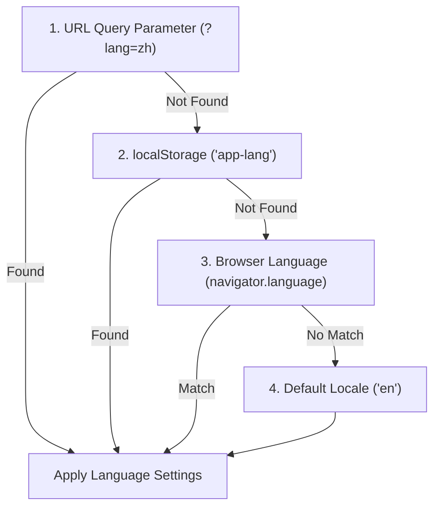

# Localization & Internationalization (i18n)

Markdown Viewer (v3.7.5) features a fully client-side translation engine that translates all user interface menus, modals, and tooltips dynamically.

---

## 🌐 Supported Languages

The application currently supports **14 language locales**:

| Locale Code | Language Name | Flag / Display Name |
| :--- | :--- | :--- |
| **`en`** | English | 🇺🇸 English |
| **`zh`** | 简体中文 (Simplified Chinese) | 🇨🇳 简体中文 |
| **`tw`** | 繁體中文 (Traditional Chinese) | 🇹🇼 繁體中文 |
| **`ja`** | 日本語 (Japanese) | 🇯🇵 日本語 |
| **`ko`** | 한국어 (Korean) | 🇰🇷 한국어 |
| **`pt`** | Português (Brasil) | 🇧🇷 Português (Brasil) |
| **`es`** | Español (Spanish) | 🇪🇸 Español |
| **`fr`** | Français (French) | 🇫🇷 Français |
| **`de`** | Deutsch (German) | 🇩🇪 Deutsch |
| **`ru`** | Русский (Russian) | 🇷🇺 Русский |
| **`it`** | Italiano (Italian) | 🇮🇹 Italiano |
| **`tr`** | Türkçe (Turkish) | 🇹РУ Türkçe |
| **`pl`** | Polski (Polish) | 🇵🇱 Polski |
| **`uk`** | Українська (Ukrainian) | 🇺🇦 Українська |

---

## ⚙️ Architecture & Selection Precedence

When a user visits the application, the translation engine resolves the locale using the following precedence cascade:



### 1. URL Query Parameter Mapping
If the URL contains a `?lang=` query parameter (e.g., `https://markdownviewer.pages.dev/?lang=pt`), it overrides all other settings.

### 2. Local Storage Persistence
When a user manually selects a language from the dropdown menu, their choice is saved to `localStorage` under the key `'app-lang'`. This preference is loaded on subsequent visits.

### 3. Automatic Browser Detection
If no parameter or storage key is found, the engine queries `navigator.language` and falls back to matching the user's primary browser settings.

---

## 📝 Localization Dictionary Schema

All translations are defined statically within `script.js` inside the `I18N_DICTS` object. The localized items use the following dictionary schema:

```javascript
{
  title: "Markdown Viewer",
  subtitle: "Live Markdown Editor",
  new: "New",
  open: "Open",
  export: "Export",
  exportMd: "Markdown (.md)",
  exportHtml: "HTML",
  exportPdf: "PDF",
  exportPng: "Image (.png)",
  copy: "Copy",
  copied: "Copied!",
  share: "Share",
  reset: "Reset",
  editor: "Editor",
  split: "Split",
  preview: "Preview",
  minRead: "Min read",
  words: "Words",
  chars: "Chars",
  switchRtl: "Switch to RTL",
  switchLtr: "Switch to LTR",
  darkMode: "Dark Mode",
  lightMode: "Light Mode",
  helpTitle: "Markdown Viewer Help",
  aboutTitle: "About Markdown",
  shareTitle: "Share Document",
  renameTitle: "Rename File",
  insertLink: "Insert Link",
  insertRef: "Insert Quote",
  insertImg: "Insert Image",
  insertTable: "Insert Table",
  findReplace: "Find & Replace",
  placeholder: "Type your markdown here...",
  loadingEmojis: "Loading emojis...",
  loadingFiles: "Fetching file structure..."
}
```
