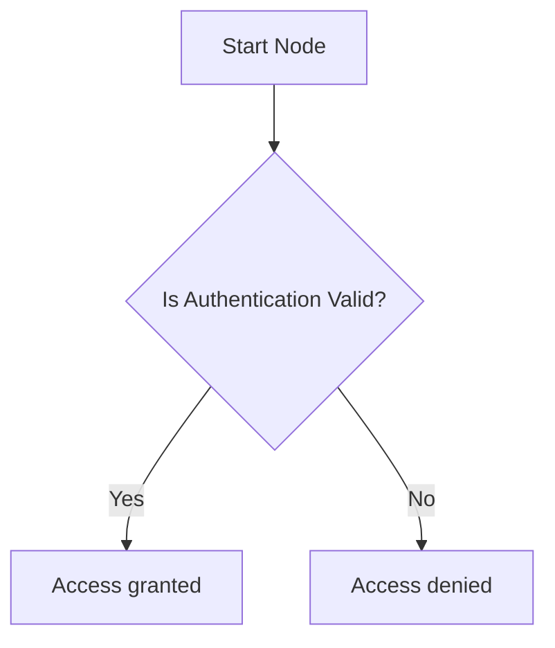
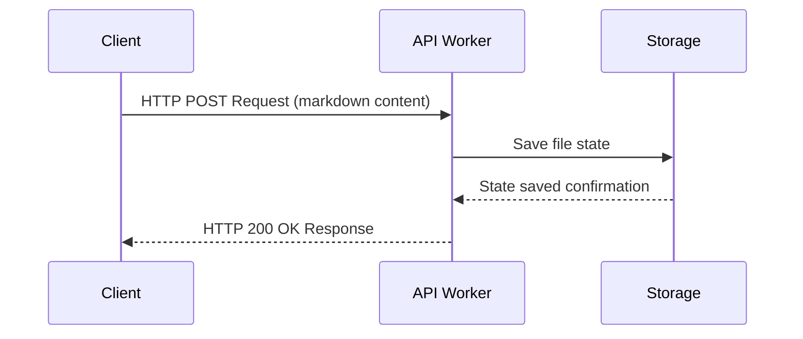
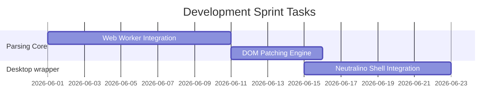

# Markdown Syntax Reference

This page provides a comprehensive guide to writing GitHub-Flavored Markdown (GFM), LaTeX math formulas, and Mermaid diagrams in **Markdown Viewer** (v3.7.5).

---

## Table of Contents

- [Headings](#headings)
- [Paragraphs & Line Breaks](#paragraphs--line-breaks)
- [Emphasis & Text Formatting](#emphasis--text-formatting)
- [Blockquotes](#blockquotes)
- [Lists & Task Lists](#lists--task-lists)
- [Code Elements](#code-elements)
- [Horizontal Rules](#horizontal-rules)
- [Links & Images](#links--images)
- [Tables](#tables)
- [Footnotes](#footnotes)
- [HTML Sanitized Formatting](#html-sanitized-formatting)
- [LaTeX Mathematical Formulas](#latex-mathematical-formulas)
- [Mermaid Diagrams](#mermaid-diagrams)
- [Emoji & Alerts](#emoji--alerts)

---

## Headings

You can write headings using hash symbols (`#`) at the beginning of a line:

```markdown
# Heading 1 (Document Title)
## Heading 2 (Main Section)
### Heading 3 (Sub-Section)
#### Heading 4
##### Heading 5
###### Heading 6
```

Alternative Setext syntax for Heading 1 and Heading 2:
```markdown
Heading 1
=========

Heading 2
---------
```

---

## Paragraphs & Line Breaks

*   **Paragraphs:** Separate paragraphs with a blank line.
*   **Line Breaks:** Insert two spaces at the end of a line, or end the line with a backslash (`\`), to start a new line within the same paragraph.

```markdown
This is paragraph one.

This is paragraph two.

Line one (ended with a backslash)\
Line two inside the same paragraph.

Line one (ended with two spaces)  
Line two inside the same paragraph.
```

---

## Emphasis & Text Formatting

| Style | Syntax | Output |
| :--- | :--- | :--- |
| **Italic** | `*text*` or `_text_` | *Italic* |
| **Bold** | `**text**` or `__text__` | **Bold** |
| **Bold Italic** | `***text***` | ***Bold Italic*** |
| **Strikethrough** | `~~text~~` | ~~Strikethrough~~ |
| **Underline (HTML)** | `<u>text</u>` | <u>Underline</u> |
| **Highlight (HTML)** | `<mark>text</mark>` | <mark>Highlight</mark> |

---

## Blockquotes

Use the `>` symbol to indent blockquotes:

```markdown
> This is a blockquote.
>
> You can write multiple paragraphs inside a blockquote.
>
>> This is a nested blockquote level 2.
```

---

## Lists & Task Lists

### Unordered Lists
Use `-`, `*`, or `+` to create bulleted lists:
```markdown
- Item A
- Item B
  - Nested Item B1
  - Nested Item B2
```

### Ordered Lists
Use numbers followed by a period:
```markdown
1. First item
2. Second item
   1. Nested ordered item
```

### GFM Task Checklists
```markdown
- [x] Completed task item
- [ ] Incomplete task item
- [x] Another completed task
```

---

## Code Elements

### Inline Code
Wrap inline code code segments in single backticks:
```markdown
Use the `const api = "/v1"` configuration variable to target the endpoint.
```

### Code Blocks with Syntax Highlighting
Wrap code blocks in triple backticks and specify the programming language (e.g. `javascript`, `python`, `html`, `css`, `bash`, `yaml`) to enable syntax highlighting:

````markdown
```javascript
const greet = (name) => {
    return `Hello, ${name}!`;
};
console.log(greet("Developer"));
```
````

---

## Horizontal Rules

Insert three or more hyphens, asterisks, or underscores on a line by themselves to create a divider:

```markdown
---
***
___
```

---

## Links & Images

### Links
```markdown
# Inline link
[GitHub](https://github.com)

# Link with a title tooltip
[GitHub](https://github.com "GitHub Homepage")

# Reference link
[GitHub][github-link]

[github-link]: https://github.com
```

### Images
```markdown
# Standard image


# Image with a title tooltip


# Reference-style image
![Alt text][logo-image]

[logo-image]: assets/icon.jpg
```

---

## Tables

Use vertical bars `|` to separate columns and hyphens `-` to create the header divider. You can align columns using colons `:`:

```markdown
| Product Name | Quantity | Price |
| :--- | :---: | ---: |
| Markdown Editor | 1 | $0.00 |
| PDF Exporter | 5 | $0.00 |
| Dynamic Diagrams | 2 | $0.00 |
```

*   `:---`: Left-aligned (default).
*   `:---:`: Center-aligned.
*   `---:`: Right-aligned.

---

## Footnotes

Add footnotes using carets `[^]`:

```markdown
Here is a sentence with a footnote citation.[^1]

[^1]: This is the text of the footnote displayed at the bottom of the page.
```

---

## HTML Sanitized Formatting

You can write HTML tags directly in your Markdown files. The application sanitizes HTML using **DOMPurify** to block unsafe code (like `<script>` elements and inline event handlers):

```html
<details>
  <summary>Click to expand additional configurations</summary>
  <p>Here is some additional content tucked inside an HTML details tag.</p>
</details>

<div class="alert alert-info">
  This is a custom alert box using Bootstrap styles.
</div>
```

---

## LaTeX Mathematical Formulas

LaTeX mathematical equations are typeset in real time using MathJax.

### Inline Math
Wrap formulas in single dollar signs (`$`):
```markdown
The quadratic formula is defined as $x = \frac{-b \pm \sqrt{b^2 - 4ac}}{2a}$ when solving equations.
```

### Block Math
Wrap formulas in double dollar signs (`$$`):
```markdown
$$
\int_{a}^{b} f(x) \,dx = F(b) - F(a)
$$
```

### LaTeX Examples

| Description | Formula Syntax |
| :--- | :--- |
| **Fractions** | `\frac{numerator}{denominator}` |
| **Integrals** | `\int_{lower}^{upper} x^2 \,dx` |
| **Summations** | `\sum_{i=1}^{n} a_i` |
| **Matrices** | `\begin{matrix} a & b \\ c & d \end{matrix}` |
| **Greek Letters** | `\alpha, \beta, \gamma, \theta, \lambda` |
| **Roots** | `\sqrt{x^2 + y^2}` |

---

## Mermaid Diagrams

Wrap Mermaid syntax in a fenced code block with the `mermaid` language tag:

### Flowchart
````markdown

````

### Sequence Diagram
````markdown

````

### Gantt Chart
````markdown

````

---

## Emoji & Alerts

### Emoji
Use emoji shortcodes to insert icons:
```markdown
:rocket: :tada: :sparkles: :warning: :memo:
```
*   Renders as: 🚀 🎉 ✨ ⚠️ 📝

### GitHub Alerts
GitHub-style alert callouts are rendered with corresponding styling:

```markdown
> [!NOTE]
> This is a general note callout box.

> [!TIP]
> This is a helpful tip callout box.

> [!IMPORTANT]
> This is a critical important callout box.

> [!WARNING]
> This is a warning callout box.

> [!CAUTION]
> This is a caution callout box.
```
